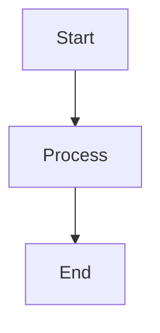

# Mermaid Debug Page

This page is for debugging Mermaid rendering. 

## Simple Test

```mermaid
graph TD
    A[Start] --> B[Process]
    B --> C[End]
```

## Debug Information

**Instructions**: Open your browser's developer console (F12) to see debug information.