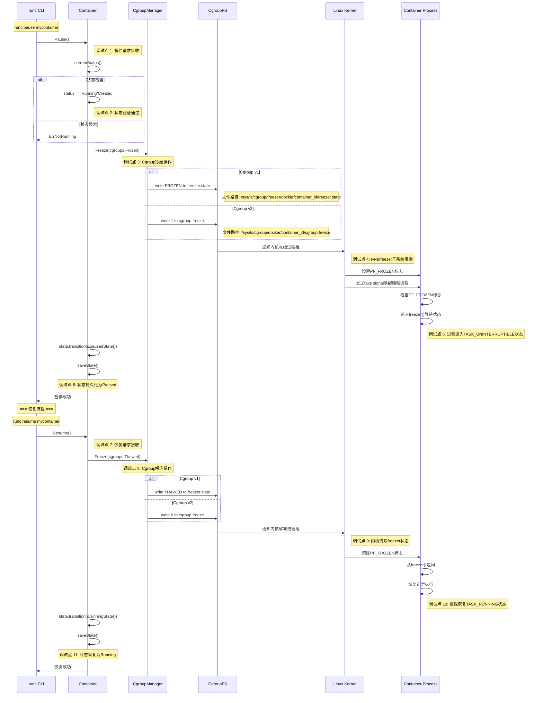
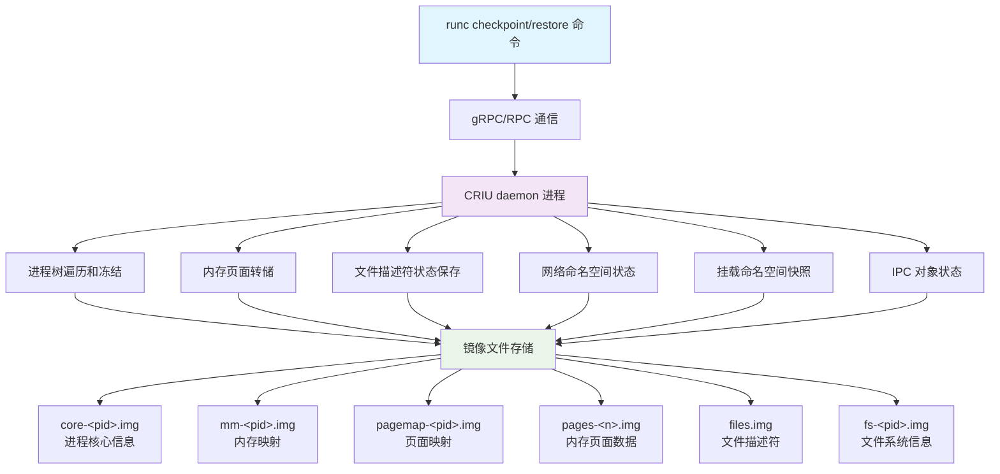
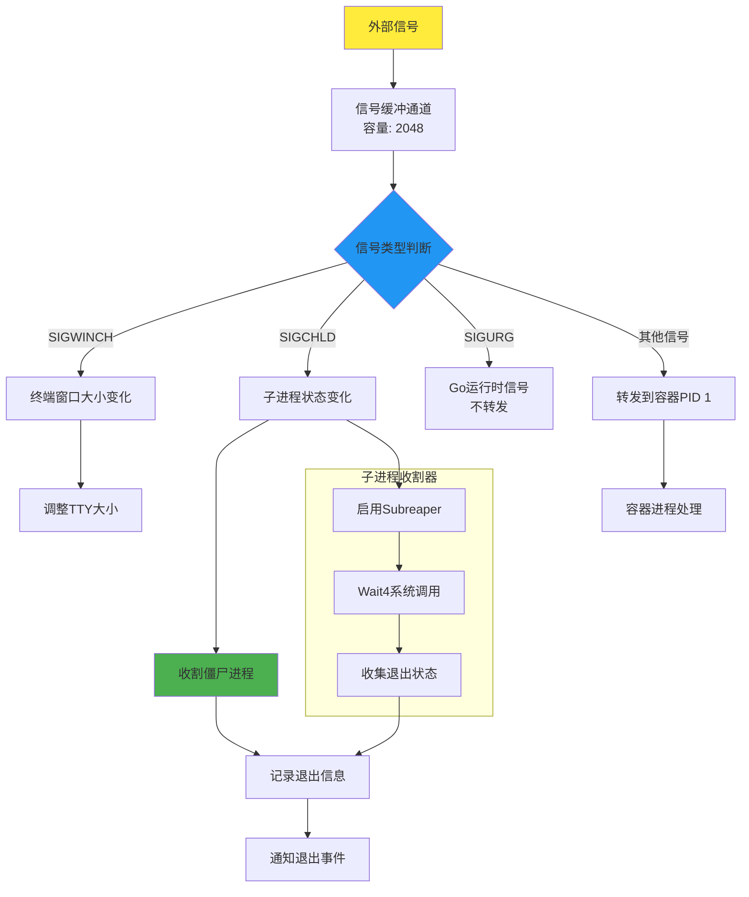
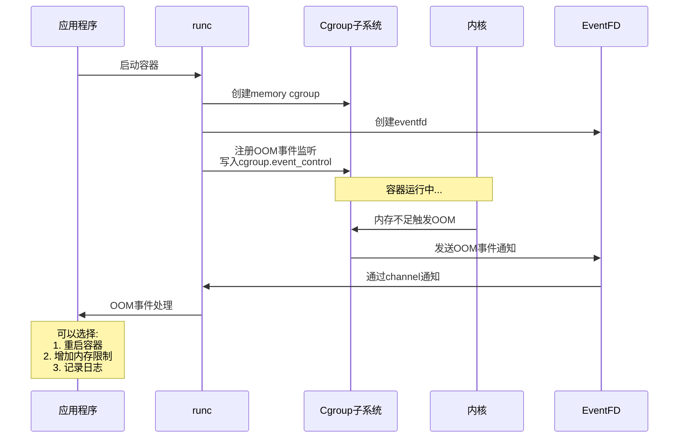

# runc 容器生命周期高级流程深度分析

## 目录

1. [容器暂停/恢复机制深度解析](#1-容器暂停恢复机制深度解析)
2. [CRIU检查点/恢复完整流程](#2-criu检查点恢复完整流程)
3. [容器动态更新机制](#3-容器动态更新机制)
4. [容器执行(exec)深度实现](#4-容器执行exec深度实现)
5. [容器删除和资源清理](#5-容器删除和资源清理)
6. [信号处理和进程管理](#6-信号处理和进程管理)
7. [事件监控和统计收集](#7-事件监控和统计收集)
8. [高级网络操作实现](#8-高级网络操作实现)
9. [设备管理详细机制](#9-设备管理详细机制)
10. [挂载和文件系统操作](#10-挂载和文件系统操作)
11. [安全攻击向量与防护](#11-安全攻击向量与防护)

---

## 1. 容器暂停/恢复机制深度解析

### 1.1 核心实现原理

#### Cgroup Freezer 子系统
```
cgroup freezer 工作原理:
┌─────────────────────────────────────────────────────────┐
│ 用户空间 (runc pause/resume)                            │
├─────────────────────────────────────────────────────────┤
│ 写入 freezer.state (v1) / cgroup.freeze (v2)           │
├─────────────────────────────────────────────────────────┤
│ 内核 freezer 子系统                                    │
│ ┌─────────────────────────────────────────────────────┐ │
│ │ 1. 遍历 cgroup 中的所有进程                        │ │
│ │ 2. 设置每个进程的 PF_FROZEN 标志                   │ │
│ │ 3. 发送 fake signal 唤醒睡眠进程                   │ │
│ │ 4. 进程检查 PF_FROZEN 后进入 freezer()             │ │
│ │ 5. 进程在 freezer() 中无限等待                     │ │
│ └─────────────────────────────────────────────────────┘ │
├─────────────────────────────────────────────────────────┤
│ 进程状态: TASK_UNINTERRUPTIBLE (D state)               │
└─────────────────────────────────────────────────────────┘
```

### 1.2 详细实现流程

#### 暂停操作 (pause.go → container_linux.go)

**位置：** `libcontainer/container_linux.go:772-789`

```go
func (c *Container) Pause() error {
    c.m.Lock()
    defer c.m.Unlock()
    
    // 1. 状态验证
    status, err := c.currentStatus()
    if err != nil {
        return err
    }
    
    switch status {
    case Running, Created:
        // 2. 执行 cgroup freezer 操作
        if err := c.cgroupManager.Freeze(cgroups.Frozen); err != nil {
            return err
        }
        
        // 3. 状态转换到暂停状态
        return c.state.transition(&pausedState{c: c})
    }
    return ErrNotRunning
}
```

#### Cgroup Manager 实现细节

**位置：** 通过 `opencontainers/cgroups` 库实现

```go
// Cgroup v1 实现
func (m *Manager) Freeze(state cgroups.FreezerState) error {
    freezerFile := filepath.Join(m.path, "freezer.state")
    
    switch state {
    case cgroups.Frozen:
        return ioutil.WriteFile(freezerFile, []byte("FROZEN"), 0644)
    case cgroups.Thawed:
        return ioutil.WriteFile(freezerFile, []byte("THAWED"), 0644)
    }
}

// Cgroup v2 实现
func (m *Manager) Freeze(state cgroups.FreezerState) error {
    freezerFile := filepath.Join(m.path, "cgroup.freeze")
    
    switch state {
    case cgroups.Frozen:
        return ioutil.WriteFile(freezerFile, []byte("1"), 0644)
    case cgroups.Thawed:
        return ioutil.WriteFile(freezerFile, []byte("0"), 0644)
    }
}
```

### 1.3 特殊情况处理

#### 暂停状态下的 SIGKILL 处理

**位置：** `libcontainer/container_linux.go:424-430`

```go
if s == unix.SIGKILL {
    // 特殊处理：暂停状态下的 SIGKILL
    if paused, _ := c.isPaused(); paused {
        // 必须先解冻才能杀死进程
        _ = c.cgroupManager.Freeze(cgroups.Thawed)
    }
}
```

**原因分析：**
- 暂停状态下进程无法处理信号
- SIGKILL 需要进程能够接收和处理
- 必须先解冻进程组，再发送 SIGKILL

#### 恢复操作实现

```go
func (c *Container) Resume() error {
    c.m.Lock()
    defer c.m.Unlock()
    
    // 1. 解冻 cgroup
    if err := c.cgroupManager.Freeze(cgroups.Thawed); err != nil {
        return err
    }
    
    // 2. 状态转换回运行状态
    return c.state.transition(&runningState{c: c})
}
```

### 1.4 暂停/恢复调试追踪流程图



### 1.5 暂停/恢复过程中的特殊情况调试

```mermaid
graph TD
    A[暂停状态容器] --> B{接收信号}
    
    B -->|SIGKILL| C[检测容器暂停状态]
    B -->|其他信号| D[信号被阻塞]
    
    C --> E[临时解冻容器]
    E --> F[发送SIGKILL]
    F --> G[进程终止]
    
    D --> H[等待恢复后处理]
    
    subgraph DEBUG["调试追踪点"]
        T1[监控freezer.state变化]
        T2[进程状态检查: /proc/pid/stat]
        T3[信号队列状态: /proc/pid/status]
        T4[cgroup进程列表变化]
    end
    
    I[调试命令示例] --> J[watch cat /sys/fs/cgroup/freezer/.../freezer.state]
    I --> K[ps axo pid,ppid,state,comm | grep container]
    I --> L[kill -0 pid # 测试进程是否存活]
    
    style A fill:#f9f,stroke:#333,stroke-width:2px
    style T1 fill:#ff9,stroke:#333,stroke-width:1px
    style T2 fill:#ff9,stroke:#333,stroke-width:1px
    style T3 fill:#ff9,stroke:#333,stroke-width:1px
    style T4 fill:#ff9,stroke:#333,stroke-width:1px
```

### 1.6 暂停/恢复调试验证脚本

```bash
#!/bin/bash
# runc pause/resume 调试验证脚本

CONTAINER_ID="debug-container"
CGROUP_PATH="/sys/fs/cgroup"

echo "=== 暂停/恢复调试验证 ==="

# 1. 创建并启动容器
echo "1. 创建容器..."
runc create $CONTAINER_ID
runc start $CONTAINER_ID

# 2. 获取容器进程信息
CONTAINER_PID=$(runc state $CONTAINER_ID | jq -r '.pid')
echo "容器主进程PID: $CONTAINER_PID"

# 3. 监控容器状态变化
monitor_container_state() {
    while true; do
        STATE=$(ps -o state --no-headers -p $CONTAINER_PID 2>/dev/null || echo "N/A")
        FREEZER_STATE=$(cat $CGROUP_PATH/freezer/docker/$CONTAINER_ID/freezer.state 2>/dev/null || echo "N/A")
        RUNC_STATE=$(runc state $CONTAINER_ID | jq -r '.status')
        
        echo "$(date '+%H:%M:%S') - PID:$CONTAINER_PID State:$STATE Freezer:$FREEZER_STATE runc:$RUNC_STATE"
        sleep 1
    done
}

# 4. 后台启动状态监控
monitor_container_state &
MONITOR_PID=$!

# 5. 执行暂停操作
echo "2. 暂停容器..."
sleep 2
runc pause $CONTAINER_ID

# 6. 验证暂停状态
echo "3. 验证暂停状态..."
sleep 3

# 7. 尝试发送信号（应该被阻塞）
echo "4. 测试信号处理（SIGUSR1）..."
kill -USR1 $CONTAINER_PID 2>/dev/null && echo "信号发送成功" || echo "信号被阻塞"

# 8. 恢复容器
echo "5. 恢复容器..."
sleep 2
runc resume $CONTAINER_ID

# 9. 验证恢复状态
echo "6. 验证恢复状态..."
sleep 3

# 10. 清理
kill $MONITOR_PID
runc kill $CONTAINER_ID KILL
runc delete $CONTAINER_ID

echo "=== 调试验证完成 ==="
```

---

## 2. CRIU检查点/恢复完整流程

### 2.1 CRIU 集成架构



### 2.2 检查点创建流程

#### 版本兼容性检查

**位置：** `libcontainer/criu_linux.go:280-292`

```go
func (c *Container) Checkpoint(criuOpts *CriuOpts) error {
    // CRIU 版本检查 (需要 3.0.0+)
    if err := c.checkCriuVersion(30000); err != nil {
        return err
    }
    
    // 特性检查
    criuFeatures, err := c.criuFeatures()
    if err != nil {
        return err
    }
    
    if err := c.checkCriuFeatures(criuOpts, criuFeatures); err != nil {
        return err
    }
}
```

#### RPC 选项配置

**位置：** `libcontainer/criu_linux.go:340-408`

```go
rpcOpts := criurpc.CriuOpts{
    ImagesDirFd:     proto.Int32(int32(imageDir.Fd())),
    WorkDirFd:       proto.Int32(int32(workDir.Fd())),
    LogLevel:        proto.Int32(4),
    LogFile:         proto.String("dump.log"),
    Root:            proto.String(c.config.Rootfs),
    ManageCgroups:   proto.Bool(true),
    TcpEstablished:  proto.Bool(criuOpts.TcpEstablished),
    ExtUnixSk:       proto.Bool(criuOpts.ExternalUnixConnections),
    ShellJob:        proto.Bool(criuOpts.ShellJob),
    FileLocks:       proto.Bool(criuOpts.FileLocks),
    Pid:             proto.Int32(int32(c.initProcess.pid())),
}
```

#### 外部命名空间处理

**位置：** `libcontainer/criu_linux.go:189-209`

```go
func (c *Container) handleCheckpointingExternalNamespaces(rpcOpts *criurpc.CriuOpts, t configs.NamespaceType) error {
    nsPath := c.config.Namespaces.PathOf(t)
    if nsPath == "" {
        return nil
    }
    
    var ns unix.Stat_t
    if err := unix.Stat(nsPath, &ns); err != nil {
        return fmt.Errorf("stat of %s failed: %w", nsPath, err)
    }
    
    // 生成外部命名空间标识符
    criuExternal := fmt.Sprintf("%s[%d]:%s", configs.NsName(t), ns.Ino, criuNsToKey(t))
    rpcOpts.External = append(rpcOpts.External, criuExternal)
    
    return nil
}
```

### 2.3 内存页面管理

#### Lazy Pages 支持

**位置：** `libcontainer/criu_linux.go:409-435`

```go
if criuOpts.LazyPages {
    // Lazy pages 需要 userfaultfd 支持
    rpcOpts.LazyPages = proto.Bool(true)
    
    if criuOpts.StatusFd != -1 {
        rpcOpts.StatusFd = proto.Int32(int32(criuOpts.StatusFd))
    }
    
    // 页面服务器配置
    if criuOpts.PageServer.Address != "" {
        rpcOpts.PsSocket = proto.String(criuOpts.PageServer.Address)
        if criuOpts.PageServer.Port != 0 {
            rpcOpts.PsPort = proto.Int32(criuOpts.PageServer.Port)
        }
    }
}
```

#### 内存去重

```go
if criuOpts.AutoDedup {
    rpcOpts.AutoDedup = proto.Bool(true)
}
```

### 2.4 恢复流程实现

#### 挂载准备

**位置：** `libcontainer/criu_linux.go:622-674`

```go
// 为 CRIU 恢复准备绑定挂载
root := filepath.Join(c.stateDir, "criu-root") 
if err := os.MkdirAll(root, 0o755); err != nil {
    return nil, err
}

// 绑定挂载容器根文件系统
err = mount(c.config.Rootfs, root, "", unix.MS_BIND|unix.MS_REC, "")
if err != nil {
    return nil, err
}
defer func() {
    _ = unix.Unmount(root, unix.MNT_DETACH)
    _ = os.RemoveAll(root)
}()
```

#### 进程恢复和监控

**位置：** `libcontainer/criu_linux.go:723-801`

```go
for {
    select {
    case notify := <-notifyReceive:
        switch notify.GetScript() {
        case "post-restore":
            // 恢复后处理
            pid := notify.GetPid()
            logrus.Debugf("restore: got post-restore event, pid: %d", pid)
            
            p, err := os.FindProcess(int(pid))
            if err != nil {
                return nil, err
            }
            
            cmd.Process = p
            // 创建恢复后的进程对象
            r, err := newRestoredProcess(cmd, fds)
            if err != nil {
                return nil, err
            }
            process.ops = r
            
        case "network-unlock":
            // 网络解锁
            if err := c.criuNotifications(notify, notifySend, criuOpts); err != nil {
                return nil, err
            }
        }
    case err := <-criuProcessDone:
        return process, err
    }
}
```

---

## 3. 容器动态更新机制

### 3.1 支持的动态更新类型

```
动态更新支持矩阵:
┌─────────────────────┬──────────────────┬──────────────────┐
│ 资源类型            │ 支持动态更新     │ 限制条件         │
├─────────────────────┼──────────────────┼──────────────────┤
│ CPU Shares          │ ✓                │ 无               │
│ CPU Quota/Period    │ ✓                │ 必须同时设置     │
│ CPU Set (亲和性)    │ ✓                │ 有效CPU范围      │
│ Memory Limit        │ ✓                │ 不能小于当前使用 │
│ Memory Swap         │ ✓                │ 依赖内核支持     │
│ Memory Swappiness   │ ✓                │ 0-100范围        │
│ Block I/O Weight    │ ✓                │ 10-1000范围      │
│ Block I/O Throttle  │ ✓                │ 设备存在         │
│ PID Limit           │ ✓                │ 不能小于当前PID数│
│ Intel RDT           │ ✓                │ 硬件支持         │
└─────────────────────┴──────────────────┴──────────────────┘
```

### 3.2 更新实现机制

#### 核心更新函数

**位置：** `libcontainer/container_linux.go:164-197`

```go
func (c *Container) Set(config *configs.Config) error {
    c.m.Lock()
    defer c.m.Unlock()
    
    // 1. 状态检查
    status, err := c.currentStatus()
    if err != nil {
        return err
    }
    if status == Stopped {
        return ErrNotRunning
    }
    
    // 2. 应用 cgroup 资源更新
    if err := c.cgroupManager.Set(config.Cgroups.Resources); err != nil {
        // 3. 失败回滚机制
        if err2 := c.cgroupManager.Set(c.config.Cgroups.Resources); err2 != nil {
            logrus.Warnf("Setting back cgroup configs failed")
        }
        return err
    }
    
    // 4. 更新容器配置
    c.config = config
    return nil
}
```

#### CPU 配额和周期的协调更新

**位置：** `update.go:298-331`

```go
// CPU quota/period 必须协调更新
func validateCpuQuotaPeriod(p uint64, q int64) error {
    // 验证 period 和 quota 的组合合理性
    if (p == 0 && q == 0) || (p != 0 && q != 0) {
        // 两者都设置或都不设置
        config.Cgroups.Resources.CpuPeriod = p
        config.Cgroups.Resources.CpuQuota = q
    } else {
        // 部分更新时保持现有值
        if p != 0 {
            config.Cgroups.Resources.CpuPeriod = p
            // 保持现有 quota
        }
        if q != 0 {
            config.Cgroups.Resources.CpuQuota = q
            // 保持现有 period
        }
    }
    return nil
}
```

### 3.3 Intel RDT 动态配置

**位置：** `update.go:364-392`

```go
// Intel RDT 资源配置更新
if l3CacheSchema != "" || memBwSchema != "" {
    if config.IntelRdt == nil {
        config.IntelRdt = &configs.IntelRdt{}
    }
    
    // L3 缓存分配模式
    if l3CacheSchema != "" {
        config.IntelRdt.L3CacheSchema = l3CacheSchema
    }
    
    // 内存带宽分配模式
    if memBwSchema != "" {
        config.IntelRdt.MemBwSchema = memBwSchema
    }
    
    // 创建或更新 Intel RDT 管理器
    intelRdtManager := intelrdt.NewManager(&config, container.ID(), state.IntelRdtPath)
    if err := intelRdtManager.Apply(state.InitProcessPid); err != nil {
        return err
    }
}
```

---

## 4. 容器执行(exec)深度实现

### 4.1 命名空间加入机制

#### setns 进程创建

**位置：** `libcontainer/container_linux.go:635-689`

```go
func (c *Container) newSetnsProcess(p *Process, cmd *exec.Cmd, comm *processComm) (*setnsProcess, error) {
    // 1. 设置初始化类型
    cmd.Env = append(cmd.Env, "_LIBCONTAINER_INITTYPE="+string(initSetns))
    
    // 2. 获取容器状态
    state := c.currentState()
    
    // 3. 生成引导数据
    data, err := c.bootstrapData(0, state.NamespacePaths)
    if err != nil {
        return nil, err
    }
    
    // 4. 创建 setns 进程对象
    proc := &setnsProcess{
        cmd:                 cmd,
        comm:                comm,
        cgroupPaths:         state.CgroupPaths,
        rootlessCgroups:     c.config.RootlessCgroups,
        intelRdtPath:        state.IntelRdtPath,
        initProcessPid:      state.InitProcessPid,
        config:              c.newProcessConfig(p),
        process:             p,
        bootstrapData:       io.MultiReader(bytes.NewReader(data), proc.comm.initSockParent),
        initProcessStarted:  c.initProcessStarted,
    }
    
    return proc, nil
}
```

### 4.2 子 Cgroup 管理

#### 子 Cgroup 路径解析

**位置：** `exec.go:125-153`

```go
func getSubCgroupPaths(args []string) (map[string]string, error) {
    paths := make(map[string]string, len(args))
    
    for _, c := range args {
        if ctr, path, ok := strings.Cut(c, ":"); ok {
            // cgroup v1 格式: controller:path
            for _, ctrl := range strings.Split(ctr, ",") {
                paths[ctrl] = path
            }
        } else {
            // cgroup v2 格式: path (统一层次结构)
            paths[""] = c
        }
    }
    
    return paths, nil
}
```

#### 子 Cgroup 创建和配置

```go
func (c *Container) createExecSubCgroup(subCgroupPaths map[string]string) error {
    if len(subCgroupPaths) == 0 {
        return nil
    }
    
    // 创建子 cgroup
    for controller, path := range subCgroupPaths {
        if controller == "" {
            // cgroup v2
            fullPath := filepath.Join(c.cgroupManager.Path(""), path)
        } else {
            // cgroup v1
            fullPath := filepath.Join(c.cgroupManager.Path(controller), path)
        }
        
        if err := os.MkdirAll(fullPath, 0o755); err != nil {
            return fmt.Errorf("failed to create exec sub-cgroup %s: %w", fullPath, err)
        }
    }
    
    return nil
}
```

### 4.3 安全上下文继承

#### 进程凭据设置

```go
func (p *setnsProcess) start() error {
    // 1. 命名空间加入 (setns 系统调用)
    for _, ns := range p.config.Config.Namespaces {
        if ns.Path != "" {
            // 加入现有命名空间
            if err := unix.Setns(int(fd.Fd()), int(ns.Type)); err != nil {
                return fmt.Errorf("failed to setns %s: %w", ns.Type, err)
            }
        }
    }
    
    // 2. 用户凭据设置
    if err := setupUser(p.config); err != nil {
        return fmt.Errorf("failed to setup user: %w", err)
    }
    
    // 3. 安全标签应用
    if p.config.ProcessLabel != "" {
        if err := label.SetProcessLabel(p.config.ProcessLabel); err != nil {
            return fmt.Errorf("failed to set process label: %w", err)
        }
    }
    
    // 4. Capabilities 设置
    if err := capabilities.Apply(p.config.Capabilities); err != nil {
        return fmt.Errorf("failed to apply capabilities: %w", err)
    }
    
    return nil
}
```

---

## 5. 容器删除和资源清理

### 5.1 删除操作流程

#### 强制终止策略

**位置：** `delete.go:16-25`

```go
func killContainer(container *libcontainer.Container) error {
    // 1. 发送 SIGKILL 信号
    _ = container.Signal(unix.SIGKILL)
    
    // 2. 等待进程终止 (最多10秒)
    for i := 0; i < 100; i++ {
        time.Sleep(100 * time.Millisecond)
        
        // 3. 检查进程是否仍然存在
        if err := container.Signal(unix.Signal(0)); err != nil {
            // 进程已终止，执行清理
            return container.Destroy()
        }
    }
    
    return errors.New("container init still running")
}
```

### 5.2 资源清理详细流程

#### 容器销毁实现

**位置：** `libcontainer/container_linux.go:754-768`

```go
func (c *Container) Destroy() error {
    c.m.Lock()
    defer c.m.Unlock()
    
    // 1. 状态驱动的清理
    if err := c.state.destroy(); err != nil {
        return fmt.Errorf("unable to destroy container: %w", err)
    }
    
    return nil
}
```

#### 状态相关的清理操作

```go
// runningState 的清理
func (r *runningState) destroy() error {
    // 1. 终止所有进程
    if err := r.c.signal(unix.SIGKILL); err != nil {
        return err
    }
    
    // 2. 等待进程终止
    if err := r.c.initProcess.wait(); err != nil {
        return err
    }
    
    // 3. 清理 cgroup
    if err := r.c.cgroupManager.Destroy(); err != nil {
        return err
    }
    
    // 4. 清理 Intel RDT
    if r.c.intelRdtManager != nil {
        if err := r.c.intelRdtManager.Destroy(); err != nil {
            return err
        }
    }
    
    // 5. 清理状态目录
    return os.RemoveAll(r.c.root)
}
```

### 5.3 Cgroup 清理验证

#### 进程疏散确认

```go
func (m *Manager) Destroy() error {
    // 1. 检查 cgroup 是否为空
    pids, err := m.GetAllPids()
    if err != nil {
        return err
    }
    
    if len(pids) > 0 {
        return fmt.Errorf("cgroup still contains %d processes", len(pids))
    }
    
    // 2. 移除 cgroup 目录
    for _, subsystem := range []string{"memory", "cpu", "pids", "blkio"} {
        cgroupPath := filepath.Join("/sys/fs/cgroup", subsystem, m.path)
        if err := os.Remove(cgroupPath); err != nil && !os.IsNotExist(err) {
            return fmt.Errorf("failed to remove cgroup %s: %w", cgroupPath, err)
        }
    }
    
    return nil
}
```

---

## 6. 信号处理和进程管理

### 6.1 信号处理架构

#### 信号处理流程图



#### 信号缓冲和转发机制

**位置：** `signals.go:21-45`

```go
func newSignalHandler(enableSubreaper bool, notifySocket *notifySocket) *signalHandler {
    // 1. 启用子进程收割器
    if enableSubreaper {
        if err := system.SetSubreaper(1); err != nil {
            logrus.Warn(err)
        }
    }
    
    // 2. 创建信号缓冲通道 (容量 2048)
    s := make(chan os.Signal, signalBufferSize)
    
    // 3. 捕获所有信号
    signal.Notify(s)
    
    return &signalHandler{
        signals: s,
        notify:  notifySocket,
    }
}
```

### 6.2 进程树信号管理

#### 特殊信号处理

**位置：** `libcontainer/container_linux.go:383-413`

```go
func (c *Container) Signal(s os.Signal) error {
    // 1. SIGKILL 在非 PID 命名空间的特殊处理
    if s == unix.SIGKILL && !c.config.Namespaces.IsPrivate(configs.NEWPID) {
        // 必须杀死 cgroup 中的所有进程
        if err := signalAllProcesses(c.cgroupManager, unix.SIGKILL); err != nil {
            return fmt.Errorf("unable to kill all processes: %w", err)
        }
        return nil
    }
    
    // 2. 常规信号转发
    return c.signal(s)
}
```

#### 批量进程信号发送

```go
func signalAllProcesses(manager cgroups.Manager, s unix.Signal) error {
    // 1. 获取 cgroup 中的所有进程
    pids, err := manager.GetAllPids()
    if err != nil {
        return err
    }
    
    // 2. 向每个进程发送信号
    for _, pid := range pids {
        if err := unix.Kill(pid, s); err != nil {
            // 忽略进程已不存在的错误
            if err == unix.ESRCH {
                continue
            }
            return fmt.Errorf("failed to signal process %d: %w", pid, err)
        }
    }
    
    return nil
}
```

### 6.3 僵尸进程收割

#### 子进程状态收集

**位置：** `signals.go:127-148`

```go
func (h *signalHandler) reap() (exits []exit, err error) {
    for {
        var ws unix.WaitStatus
        var rus unix.Rusage
        
        // 1. 非阻塞等待子进程
        pid, err := unix.Wait4(-1, &ws, unix.WNOHANG, &rus)
        if err != nil {
            if err == unix.ECHILD {
                // 没有更多子进程
                return exits, nil
            }
            return nil, err
        }
        
        if pid <= 0 {
            // 没有退出的子进程
            return exits, nil
        }
        
        // 2. 记录退出信息
        exits = append(exits, exit{
            pid:    pid,
            status: utils.ExitStatus(ws),
            rusage: &rus,
        })
    }
}
```

### 6.4 信号转发逻辑

**位置：** `signals.go:85-122`

```go
for s := range h.signals {
    switch s {
    case unix.SIGWINCH:
        // 终端窗口大小变化
        _ = tty.resize()
        
    case unix.SIGCHLD:
        // 子进程状态变化
        exits, err := h.reap()
        if err != nil {
            logrus.Error(err)
        }
        
        for _, e := range exits {
            logrus.WithFields(logrus.Fields{
                "pid":    e.pid,
                "status": e.status,
            }).Debug("process exited")
            
            if h.notify != nil {
                h.notify.notifyExit(e)
            }
        }
        
    case unix.SIGURG:
        // Go 运行时信号，不转发
        continue
        
    default:
        // 转发其他信号到容器 PID 1
        logrus.Debugf("forwarding signal %d (%s) to %d", 
                     int(us), unix.SignalName(us), pid1)
        if err := process.Signal(s); err != nil {
            logrus.Error(err)
        }
    }
}
```

---

## 7. 事件监控和统计收集

### 7.1 实时统计收集架构

```mermaid
graph TB
    A[Container.Stats()] --> B[统计信息聚合]
    
    B --> C[Cgroup统计]
    B --> D[Intel RDT统计]
    B --> E[网络接口统计]
    
    C --> C1[内存使用量]
    C --> C2[CPU使用率]
    C --> C3[块设备I/O]
    C --> C4[进程数量]
    
    D --> D1[L3缓存占用]
    D --> D2[内存带宽使用]
    
    E --> E1[接收字节数]
    E --> E2[发送字节数]
    E --> E3[丢包统计]
    E --> E4[错误统计]
    
    subgraph "数据源"
        F1[/sys/fs/cgroup/]
        F2[/sys/fs/resctrl/]
        F3[/sys/class/net/]
    end
    
    C --> F1
    D --> F2
    E --> F3
    
    style A fill:#e3f2fd
    style B fill:#f3e5f5
    style C fill:#e8f5e8
    style D fill:#fff3e0
    style E fill:#fce4ec
```

#### 容器统计信息结构

**位置：** `libcontainer/container_linux.go:136-160`

```go
func (c *Container) Stats() (*Stats, error) {
    stats := &Stats{}
    
    // 1. Cgroup 统计信息
    if stats.CgroupStats, err = c.cgroupManager.GetStats(); err != nil {
        return stats, fmt.Errorf("unable to get container cgroup stats: %w", err)
    }
    
    // 2. Intel RDT 统计信息
    if c.intelRdtManager != nil {
        if stats.IntelRdtStats, err = c.intelRdtManager.GetStats(); err != nil {
            return stats, fmt.Errorf("unable to get container Intel RDT stats: %w", err)
        }
    }
    
    // 3. 网络接口统计
    for _, iface := range c.config.Networks {
        istats, err := getNetworkInterfaceStats(iface.HostInterfaceName)
        if err != nil {
            logrus.Warnf("failed to get network stats for %s: %v", 
                        iface.HostInterfaceName, err)
            continue
        }
        stats.Interfaces = append(stats.Interfaces, istats)
    }
    
    return stats, nil
}
```

### 7.2 OOM 通知机制

#### OOM 事件监控流程



#### Eventfd 集成实现

**位置：** `libcontainer/notify_linux.go:63-71`

```go
func notifyOnOOM(dir string) (<-chan struct{}, error) {
    return registerMemoryEvent(dir, "memory.oom_control", "")
}

func registerMemoryEvent(cgDir string, evName string, arg string) (<-chan struct{}, error) {
    // 1. 打开事件文件
    evFile, err := os.Open(filepath.Join(cgDir, evName))
    if err != nil {
        return nil, err
    }
    defer evFile.Close()
    
    // 2. 创建 eventfd
    fd, err := unix.Eventfd(0, unix.EFD_CLOEXEC)
    if err != nil {
        return nil, err
    }
    eventfd := os.NewFile(uintptr(fd), "eventfd")
    
    // 3. 注册事件监听
    eventControlPath := filepath.Join(cgDir, "cgroup.event_control")
    data := fmt.Sprintf("%d %d %s", eventfd.Fd(), evFile.Fd(), arg)
    if err := os.WriteFile(eventControlPath, []byte(data), 0o700); err != nil {
        eventfd.Close()
        return nil, err
    }
    
    // 4. 创建通知通道
    ch := make(chan struct{})
    go func() {
        defer eventfd.Close()
        buf := make([]byte, 8)
        for {
            if _, err := eventfd.Read(buf); err != nil {
                return
            }
            ch <- struct{}{}
        }
    }()
    
    return ch, nil
}
```

### 7.3 网络统计收集

#### 接口统计解析

```go
func getNetworkInterfaceStats(interfaceName string) (*types.NetworkInterface, error) {
    // 从 /sys/class/net/<interface>/statistics 读取统计信息
    statsPath := filepath.Join("/sys/class/net", interfaceName, "statistics")
    
    stats := &types.NetworkInterface{
        Name: interfaceName,
    }
    
    // 读取入站统计
    rxBytes, _ := readUint64File(filepath.Join(statsPath, "rx_bytes"))
    rxPackets, _ := readUint64File(filepath.Join(statsPath, "rx_packets"))
    rxErrors, _ := readUint64File(filepath.Join(statsPath, "rx_errors"))
    rxDropped, _ := readUint64File(filepath.Join(statsPath, "rx_dropped"))
    
    stats.RxBytes = rxBytes
    stats.RxPackets = rxPackets
    stats.RxErrors = rxErrors
    stats.RxDropped = rxDropped
    
    // 读取出站统计
    txBytes, _ := readUint64File(filepath.Join(statsPath, "tx_bytes"))
    txPackets, _ := readUint64File(filepath.Join(statsPath, "tx_packets"))
    txErrors, _ := readUint64File(filepath.Join(statsPath, "tx_errors"))
    txDropped, _ := readUint64File(filepath.Join(statsPath, "tx_dropped"))
    
    stats.TxBytes = txBytes
    stats.TxPackets = txPackets
    stats.TxErrors = txErrors
    stats.TxDropped = txDropped
    
    return stats, nil
}
```

---

## 8. 高级网络操作实现

### 8.1 网络设备命名空间迁移

#### 原子化设备迁移

**位置：** `libcontainer/network_linux.go:113-232`

```go
func devChangeNetNamespace(name string, nsPath string, device configs.LinuxNetDevice) error {
    // 1. 获取网络接口
    link, err := netlink.LinkByName(name)
    if err != nil {
        return fmt.Errorf("failed to find link %s: %w", name, err)
    }
    
    // 2. 关闭接口（迁移前必须）
    if err := netlink.LinkSetDown(link); err != nil {
        return fmt.Errorf("failed to set %s down: %w", name, err)
    }
    
    // 3. 保存现有 IP 地址
    addresses, err := netlink.AddrList(link, netlink.FAMILY_ALL)
    if err != nil {
        return fmt.Errorf("failed to get addresses for %s: %w", name, err)
    }
    
    // 4. 原子化重命名和命名空间迁移
    newName := device.Name
    if newName == "" {
        newName = name
    }
    
    // 打开目标命名空间
    ns, err := unix.Open(nsPath, unix.O_RDONLY, 0)
    if err != nil {
        return fmt.Errorf("failed to open namespace %s: %w", nsPath, err)
    }
    defer unix.Close(ns)
    
    // 构造 netlink 请求
    flags := unix.NLM_F_REQUEST | unix.NLM_F_ACK
    req := nl.NewNetlinkRequest(unix.RTM_NEWLINK, flags)
    req.AddData(&nl.IfInfomsg{
        Index: int32(link.Attrs().Index),
    })
    req.AddData(nl.NewRtAttr(unix.IFLA_IFNAME, nl.ZeroTerminated(newName)))
    req.AddData(nl.NewRtAttr(unix.IFLA_NET_NS_FD, nl.Uint32Attr(uint32(ns))))
    
    // 发送 netlink 消息
    if _, err := req.Execute(unix.NETLINK_ROUTE, 0); err != nil {
        return fmt.Errorf("failed to move %s to namespace: %w", name, err)
    }
    
    // 5. 在新命名空间中恢复配置
    return netns.Do(func(hostNS netns.NsHandle) error {
        defer hostNS.Close()
        
        // 在容器命名空间中重新获取接口
        nsLink, err := netlink.LinkByName(newName)
        if err != nil {
            return fmt.Errorf("failed to find %s in container: %w", newName, err)
        }
        
        // 恢复 IP 地址
        for _, address := range addresses {
            // 只恢复永久和全局地址
            if address.Flags&unix.IFA_F_PERMANENT == 0 {
                continue
            }
            if address.Scope != unix.RT_SCOPE_UNIVERSE {
                continue
            }
            
            if err := netlink.AddrAdd(nsLink, &netlink.Addr{
                IPNet: address.IPNet,
            }); err != nil {
                logrus.Warnf("failed to add address %s to %s: %v", 
                           address.IPNet, newName, err)
            }
        }
        
        // 启动接口
        return netlink.LinkSetUp(nsLink)
    })
}
```

### 8.2 Veth Pair 管理

#### Veth 对创建和配置

```go
func createVethPair(hostIfName, containerIfName string) error {
    // 1. 创建 veth 对
    veth := &netlink.Veth{
        LinkAttrs: netlink.LinkAttrs{
            Name: hostIfName,
        },
        PeerName: containerIfName,
    }
    
    if err := netlink.LinkAdd(veth); err != nil {
        return fmt.Errorf("failed to create veth pair: %w", err)
    }
    
    // 2. 获取容器端接口
    containerVeth, err := netlink.LinkByName(containerIfName)
    if err != nil {
        return fmt.Errorf("failed to find container veth: %w", err)
    }
    
    // 3. 移动容器端到容器命名空间
    if err := netlink.LinkSetNsFd(containerVeth, int(containerNS)); err != nil {
        return fmt.Errorf("failed to move container veth to namespace: %w", err)
    }
    
    // 4. 配置主机端
    hostVeth, err := netlink.LinkByName(hostIfName)
    if err != nil {
        return fmt.Errorf("failed to find host veth: %w", err)
    }
    
    // 连接到主机网桥
    if err := netlink.LinkSetMaster(hostVeth, bridge); err != nil {
        return fmt.Errorf("failed to attach to bridge: %w", err)
    }
    
    // 启动主机端接口
    return netlink.LinkSetUp(hostVeth)
}
```

---

## 9. 设备管理详细机制

### 9.1 设备管理架构

```mermaid
graph TB
    A[容器启动] --> B{需要设备设置?}
    B -->|是| C[创建设备节点]
    B -->|否| D[跳过设备设置]
    
    C --> E[默认设备创建]
    C --> F[用户自定义设备]
    
    E --> G[/dev/null]
    E --> H[/dev/zero]
    E --> I[/dev/random]
    E --> J[/dev/urandom]
    E --> K[/dev/tty]
    E --> L[/dev/console]
    E --> M[/dev/ptmx]
    
    F --> N[设备权限验证]
    N --> O[Cgroup设备控制]
    
    O --> P[设备访问规则]
    P --> Q[读权限 r]
    P --> R[写权限 w]
    P --> S[创建权限 m]
    
    subgraph "设备类型"
        T1[字符设备 c]
        T2[块设备 b]
        T3[所有设备 a]
    end
    
    P --> T1
    P --> T2
    P --> T3
    
    subgraph "热插拔处理"
        U1[Udev事件监听]
        U2[设备添加]
        U3[设备移除]
        U4[权限更新]
    end
    
    O --> U1
    U1 --> U2
    U1 --> U3
    U2 --> U4
    U3 --> U4
    
    style A fill:#e3f2fd
    style C fill:#f3e5f5
    style O fill:#e8f5e8
    style P fill:#fff3e0
```

#### 标准设备创建流程

**位置：** `libcontainer/rootfs_linux.go:165-169`

```go
if setupDev := needsSetupDev(config); setupDev {
    if err := createDevices(config); err != nil {
        return fmt.Errorf("error creating device nodes: %w", err)
    }
}
```

#### 设备节点创建实现

```go
func createDevices(config *configs.Config) error {
    // 必需的默认设备
    defaultDevices := []configs.DeviceRule{
        {Type: configs.CharDevice, Major: 1, Minor: 3, Path: "/dev/null", FileMode: 0o666, Uid: 0, Gid: 0},
        {Type: configs.CharDevice, Major: 1, Minor: 5, Path: "/dev/zero", FileMode: 0o666, Uid: 0, Gid: 0},
        {Type: configs.CharDevice, Major: 1, Minor: 7, Path: "/dev/full", FileMode: 0o666, Uid: 0, Gid: 0},
        {Type: configs.CharDevice, Major: 1, Minor: 8, Path: "/dev/random", FileMode: 0o666, Uid: 0, Gid: 0},
        {Type: configs.CharDevice, Major: 1, Minor: 9, Path: "/dev/urandom", FileMode: 0o666, Uid: 0, Gid: 0},
        {Type: configs.CharDevice, Major: 5, Minor: 0, Path: "/dev/tty", FileMode: 0o666, Uid: 0, Gid: 5},
        {Type: configs.CharDevice, Major: 5, Minor: 1, Path: "/dev/console", FileMode: 0o600, Uid: 0, Gid: 0},
        {Type: configs.CharDevice, Major: 5, Minor: 2, Path: "/dev/ptmx", FileMode: 0o666, Uid: 0, Gid: 5},
    }
    
    // 创建设备节点
    for _, device := range append(defaultDevices, config.Devices...) {
        if err := createDeviceNode(device); err != nil {
            return fmt.Errorf("failed to create device %s: %w", device.Path, err)
        }
    }
    
    return nil
}

func createDeviceNode(device configs.DeviceRule) error {
    // 1. 创建设备文件
    mode := device.FileMode | uint32(device.Type)
    dev := unix.Mkdev(uint32(device.Major), uint32(device.Minor))
    
    if err := unix.Mknod(device.Path, mode, int(dev)); err != nil {
        if !os.IsExist(err) {
            return err
        }
    }
    
    // 2. 设置所有者和权限
    if err := unix.Chown(device.Path, int(device.Uid), int(device.Gid)); err != nil {
        return err
    }
    
    return unix.Chmod(device.Path, os.FileMode(device.FileMode))
}
```

### 9.2 设备 Cgroup 控制

#### 设备访问控制

```go
type LinuxDeviceCgroup struct {
    Allow  bool     `json:"allow"`
    Type   string   `json:"type,omitempty"`   // a(all), c(char), b(block)
    Major  *int64   `json:"major,omitempty"`
    Minor  *int64   `json:"minor,omitempty"`
    Access string   `json:"access,omitempty"` // r(read), w(write), m(mknod)
}

func applyDeviceCgroupRules(manager cgroups.Manager, rules []configs.DeviceRule) error {
    for _, rule := range rules {
        if err := manager.Set(resources); err != nil {
            return fmt.Errorf("failed to apply device rule: %w", err)
        }
    }
    return nil
}
```

### 9.3 热插拔设备处理

#### Udev 事件处理

```go
func handleUdevEvent(event UdevEvent) error {
    switch event.Action {
    case "add":
        // 设备插入
        if err := createDeviceNode(event.Device); err != nil {
            return err
        }
        return updateDeviceCgroup(event.Device, true)
        
    case "remove":
        // 设备移除
        if err := removeDeviceNode(event.Device.Path); err != nil {
            return err
        }
        return updateDeviceCgroup(event.Device, false)
        
    default:
        return nil
    }
}
```

---

## 10. 挂载和文件系统操作

### 10.1 现代挂载 API 集成

#### open_tree 和 move_mount 支持

**位置：** `libcontainer/mount_linux.go:253-339`

```go
func mountFd(nsHandles *userns.Handles, m *configs.Mount) (*mountSource, error) {
    if m.IsIDMapped() {
        // 1. 使用 open_tree 创建挂载文件描述符
        flags := uint(unix.OPEN_TREE_CLONE | unix.OPEN_TREE_CLOEXEC)
        if m.Flags&unix.MS_REC == unix.MS_REC {
            flags |= unix.AT_RECURSIVE
        }
        
        fd, err := unix.OpenTree(unix.AT_FDCWD, m.Source, flags)
        if err != nil {
            return nil, fmt.Errorf("open_tree failed: %w", err)
        }
        mountFile := os.NewFile(uintptr(fd), m.Source)
        
        // 2. 配置 ID 映射
        usernsFile, err := nsHandles.Get(m.IDMapping, config)
        if err != nil {
            return nil, err
        }
        defer usernsFile.Close()
        
        setAttrFlags := unix.AT_RECURSIVE
        if err := unix.MountSetattr(int(mountFile.Fd()), "", setAttrFlags, &unix.MountAttr{
            Attr_set:  unix.MOUNT_ATTR_IDMAP,
            Userns_fd: uint64(usernsFile.Fd()),
        }); err != nil {
            return nil, fmt.Errorf("failed to set MOUNT_ATTR_IDMAP: %w", err)
        }
        
        return &mountSource{
            Type: mountSourceOpenTree,
            file: mountFile,
        }, nil
    }
    
    // 3. 传统挂载方式
    return &mountSource{
        Type: mountSourcePlain,
    }, nil
}
```

#### 文件描述符挂载

**位置：** `libcontainer/mount_linux.go:158-209`

```go
func mountViaFds(source string, srcFile *mountSource, target, dstFd, fstype string, flags uintptr, data string) error {
    isMoveMount := srcFile != nil && srcFile.Type == mountSourceOpenTree
    
    if isMoveMount {
        // 使用 move_mount 系统调用
        err = unix.MoveMount(int(srcFile.file.Fd()), "",
                           unix.AT_FDCWD, dstFd,
                           unix.MOVE_MOUNT_F_EMPTY_PATH|unix.MOVE_MOUNT_T_SYMLINKS)
        if err != nil {
            return fmt.Errorf("move_mount failed: %w", err)
        }
    } else {
        // 传统 mount 系统调用
        var src, dst string
        if srcFile != nil {
            src = fmt.Sprintf("/proc/self/fd/%d", srcFile.file.Fd())
        } else {
            src = source
        }
        
        if dstFd != "" {
            dst = dstFd
        } else {
            dst = target
        }
        
        err = unix.Mount(src, dst, fstype, flags, data)
        if err != nil {
            return fmt.Errorf("mount failed: %w", err)
        }
    }
    
    return nil
}
```

### 10.2 挂载标志处理

#### 标志字符串化

**位置：** `libcontainer/mount_linux.go`

```go
func stringifyMountFlags[Int int32plus](flags Int) string {
    flagNames := []struct {
        name string
        bits Int
    }{
        {"MS_RDONLY", unix.MS_RDONLY},
        {"MS_NOSUID", unix.MS_NOSUID},
        {"MS_NODEV", unix.MS_NODEV},
        {"MS_NOEXEC", unix.MS_NOEXEC},
        {"MS_SYNCHRONOUS", unix.MS_SYNCHRONOUS},
        {"MS_REMOUNT", unix.MS_REMOUNT},
        {"MS_MANDLOCK", unix.MS_MANDLOCK},
        {"MS_DIRSYNC", unix.MS_DIRSYNC},
        {"MS_NOSYMFOLLOW", unix.MS_NOSYMFOLLOW},
        {"MS_NOATIME", unix.MS_NOATIME},
        {"MS_NODIRATIME", unix.MS_NODIRATIME},
        {"MS_BIND", unix.MS_BIND},
        {"MS_MOVE", unix.MS_MOVE},
        {"MS_REC", unix.MS_REC},
        {"MS_SILENT", unix.MS_SILENT},
        {"MS_POSIXACL", unix.MS_POSIXACL},
        {"MS_UNBINDABLE", unix.MS_UNBINDABLE},
        {"MS_PRIVATE", unix.MS_PRIVATE},
        {"MS_SLAVE", unix.MS_SLAVE},
        {"MS_SHARED", unix.MS_SHARED},
        {"MS_RELATIME", unix.MS_RELATIME},
        {"MS_KERNMOUNT", unix.MS_KERNMOUNT},
        {"MS_I_VERSION", unix.MS_I_VERSION},
        {"MS_STRICTATIME", unix.MS_STRICTATIME},
        {"MS_LAZYTIME", unix.MS_LAZYTIME},
        {"MS_ACTIVE", unix.MS_ACTIVE},
        {"MS_NOUSER", unix.MS_NOUSER},
    }
    
    var parts []string
    for _, flag := range flagNames {
        if flags&flag.bits != 0 {
            parts = append(parts, flag.name)
            flags &^= flag.bits
        }
    }
    
    if flags != 0 {
        parts = append(parts, fmt.Sprintf("0x%x", flags))
    }
    
    return strings.Join(parts, "|")
}
```

### 10.3 Overlay 文件系统处理

#### Overlay 挂载配置

```go
func setupOverlayMount(config *configs.Mount) error {
    // 1. 解析 overlay 选项
    var lowerDirs, upperDir, workDir string
    
    for _, opt := range strings.Split(config.Data, ",") {
        if kv := strings.SplitN(opt, "=", 2); len(kv) == 2 {
            switch kv[0] {
            case "lowerdir":
                lowerDirs = kv[1]
            case "upperdir":
                upperDir = kv[1]
            case "workdir":
                workDir = kv[1]
            }
        }
    }
    
    // 2. 创建必要的目录
    if upperDir != "" {
        if err := os.MkdirAll(upperDir, 0o755); err != nil {
            return fmt.Errorf("failed to create upperdir %s: %w", upperDir, err)
        }
    }
    
    if workDir != "" {
        if err := os.MkdirAll(workDir, 0o755); err != nil {
            return fmt.Errorf("failed to create workdir %s: %w", workDir, err)
        }
    }
    
    // 3. 执行 overlay 挂载
    return unix.Mount("overlay", config.Destination, "overlay", 
                     config.Flags, config.Data)
}
```

---

## 11. 安全攻击向量与防护

### 11.1 主要攻击向量分析

#### 命名空间逃逸攻击

```
命名空间逃逸攻击向量:
┌─────────────────────────────────────────────────────────┐
│ 1. 挂载命名空间逃逸                                     │
│    ├── 共享挂载传播利用                                 │
│    ├── /proc 文件系统访问                               │
│    └── bind 挂载路径遍历                                │
│                                                        │
│ 2. PID 命名空间逃逸                                     │
│    ├── /proc/*/ns/* 符号链接利用                        │
│    ├── ptrace 系统调用攻击                              │
│    └── 进程层次结构操控                                 │
│                                                        │
│ 3. 网络命名空间绕过                                     │
│    ├── netlink 套接字滥用                               │
│    ├── 网络接口注入                                     │
│    └── 路由表污染                                       │
│                                                        │
│ 4. 用户命名空间提权                                     │
│    ├── UID/GID 映射操控                                 │
│    ├── capability 继承利用                              │
│    └── setuid 程序执行                                  │
└─────────────────────────────────────────────────────────┘
```

#### 资源耗尽攻击

```go
// 防护：内存使用限制
type MemoryAttackMitigation struct {
    // 1. 检查点大小限制
    MaxCheckpointSize int64 `json:"max_checkpoint_size"`
    
    // 2. 进程数量限制
    MaxProcesses int `json:"max_processes"`
    
    // 3. 文件描述符限制
    MaxOpenFiles int `json:"max_open_files"`
    
    // 4. CPU 使用限制
    CPUQuota int64 `json:"cpu_quota"`
    CPUPeriod int64 `json:"cpu_period"`
}

func validateResourceLimits(config *configs.Config) error {
    // 内存限制验证
    if config.Cgroups.Resources.Memory != nil {
        if *config.Cgroups.Resources.Memory > MaxAllowedMemory {
            return fmt.Errorf("memory limit exceeds maximum allowed")
        }
    }
    
    // PID 限制验证
    if config.Cgroups.Resources.PidsLimit != nil {
        if *config.Cgroups.Resources.PidsLimit > MaxAllowedPids {
            return fmt.Errorf("PID limit exceeds maximum allowed")
        }
    }
    
    return nil
}
```

### 11.2 权限提升防护

#### NoNewPrivileges 强制执行

```go
func enforceNoNewPrivileges(config *configs.Config) error {
    // 1. 强制启用 NoNewPrivileges
    config.NoNewPrivileges = true
    
    // 2. 验证 setuid/setgid 程序限制
    for _, mount := range config.Mounts {
        if mount.Flags&unix.MS_NOSUID == 0 {
            logrus.Warnf("mount %s allows setuid programs", mount.Destination)
            // 自动添加 nosuid 标志
            mount.Flags |= unix.MS_NOSUID
        }
    }
    
    // 3. Capability 最小化
    if config.Capabilities == nil {
        config.Capabilities = &configs.Capabilities{}
    }
    
    // 清空所有 capability 集合
    config.Capabilities.Bounding = []string{}
    config.Capabilities.Effective = []string{}
    config.Capabilities.Inheritable = []string{}
    config.Capabilities.Permitted = []string{}
    config.Capabilities.Ambient = []string{}
    
    return nil
}
```

### 11.3 状态一致性保护

#### 竞态条件防护

```go
func (c *Container) atomicStateTransition(newState containerState) error {
    c.m.Lock()
    defer c.m.Unlock()
    
    // 1. 验证状态转换合法性
    if !c.state.canTransitionTo(newState) {
        return fmt.Errorf("invalid state transition from %s to %s", 
                         c.state.status(), newState.status())
    }
    
    // 2. 原子性状态更新
    oldState := c.state
    c.state = newState
    
    // 3. 持久化状态变更
    if err := c.saveState(); err != nil {
        // 回滚状态
        c.state = oldState
        return fmt.Errorf("failed to save state: %w", err)
    }
    
    return nil
}
```

#### 信号处理安全

```go
func (h *signalHandler) securSignalForwarding(pid int, signal os.Signal) error {
    // 1. 验证目标进程
    if pid <= 0 {
        return fmt.Errorf("invalid PID: %d", pid)
    }
    
    // 2. 检查进程存在性
    if err := unix.Kill(pid, 0); err != nil {
        if err == unix.ESRCH {
            return fmt.Errorf("process %d not found", pid)
        }
        return fmt.Errorf("failed to check process %d: %w", pid, err)
    }
    
    // 3. 验证信号合法性
    if !isAllowedSignal(signal) {
        return fmt.Errorf("signal %v not allowed", signal)
    }
    
    // 4. 安全地发送信号
    return unix.Kill(pid, signal.(unix.Signal))
}

func isAllowedSignal(signal os.Signal) bool {
    allowedSignals := []os.Signal{
        unix.SIGTERM, unix.SIGKILL, unix.SIGSTOP, unix.SIGCONT,
        unix.SIGUSR1, unix.SIGUSR2, unix.SIGHUP, unix.SIGINT,
    }
    
    for _, allowed := range allowedSignals {
        if signal == allowed {
            return true
        }
    }
    return false
}
```

### 11.4 文件描述符安全

#### 安全文件描述符传递

```go
func safeFileDescriptorPassing(fds []string) error {
    for _, fd := range fds {
        // 1. 验证文件描述符路径
        if !isValidFdPath(fd) {
            return fmt.Errorf("invalid file descriptor path: %s", fd)
        }
        
        // 2. 检查文件权限
        fileInfo, err := os.Stat(fd)
        if err != nil {
            return fmt.Errorf("cannot stat fd %s: %w", fd, err)
        }
        
        // 3. 验证文件类型
        if !isAllowedFileType(fileInfo.Mode()) {
            return fmt.Errorf("file type not allowed for fd %s", fd)
        }
        
        // 4. 设置 CLOEXEC 标志
        file, err := os.Open(fd)
        if err != nil {
            return fmt.Errorf("cannot open fd %s: %w", fd, err)
        }
        defer file.Close()
        
        if err := unix.CloseOnExec(int(file.Fd())); err != nil {
            return fmt.Errorf("failed to set CLOEXEC on %s: %w", fd, err)
        }
    }
    
    return nil
}

func isValidFdPath(path string) bool {
    // 只允许 /proc/self/fd/ 路径
    return strings.HasPrefix(path, "/proc/self/fd/") || 
           strings.HasPrefix(path, "/dev/fd/")
}

func isAllowedFileType(mode os.FileMode) bool {
    // 允许的文件类型
    return mode.IsRegular() || 
           mode&os.ModeCharDevice != 0 || 
           mode&os.ModeNamedPipe != 0
}
```

### 11.5 挂载安全防护

#### 挂载源验证

```go
func validateMountSecurity(mount *configs.Mount) error {
    // 1. 路径遍历防护
    if strings.Contains(mount.Source, "..") {
        return fmt.Errorf("mount source contains path traversal: %s", mount.Source)
    }
    
    // 2. 敏感路径保护
    sensitivePaths := []string{
        "/proc", "/sys", "/dev", "/etc", "/boot", "/lib", "/lib64",
    }
    
    for _, sensitive := range sensitivePaths {
        if strings.HasPrefix(mount.Destination, sensitive) {
            if mount.Flags&unix.MS_NOSUID == 0 {
                mount.Flags |= unix.MS_NOSUID
            }
            if mount.Flags&unix.MS_NODEV == 0 {
                mount.Flags |= unix.MS_NODEV
            }
            if mount.Flags&unix.MS_NOEXEC == 0 {
                mount.Flags |= unix.MS_NOEXEC
            }
        }
    }
    
    // 3. 挂载类型验证
    allowedTypes := []string{
        "tmpfs", "proc", "sysfs", "devpts", "mqueue", 
        "cgroup", "cgroup2", "bind", "",
    }
    
    typeAllowed := false
    for _, allowed := range allowedTypes {
        if mount.Type == allowed {
            typeAllowed = true
            break
        }
    }
    
    if !typeAllowed {
        return fmt.Errorf("mount type %s not allowed", mount.Type)
    }
    
    return nil
}
```

---

## 总结

通过这个超深度分析，我们可以看到 runc 容器生命周期管理的复杂性和精密性：

### 关键技术洞察

1. **多层协调机制** - runc 通过精密的状态机和进程协调实现了复杂的容器生命周期管理
2. **现代 Linux API 集成** - 大量使用了 Linux 5.0+ 的新系统调用和特性
3. **防御性编程** - 每个操作都有详细的错误处理和安全验证
4. **性能优化** - 通过文件描述符传递、异步操作等技术优化性能
5. **安全优先** - 多层安全机制确保容器隔离的完整性

### 架构设计精髓

1. **状态驱动设计** - 所有操作都基于明确的状态转换
2. **资源生命周期管理** - 严格的资源创建、使用、清理流程
3. **错误恢复机制** - 完善的失败处理和资源回收
4. **可扩展架构** - 插件化的网络、存储、安全模块
5. **向后兼容** - 支持多版本 Linux 内核和特性

这个分析展现了现代容器技术的核心实现，为理解和开发高性能、高安全性的容器系统提供了宝贵的参考。