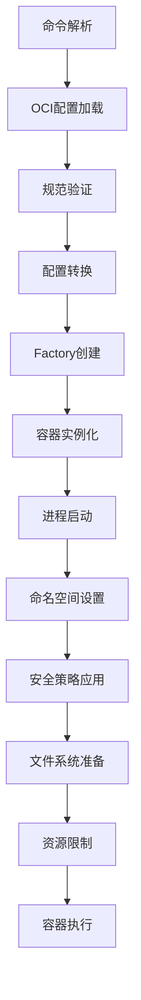
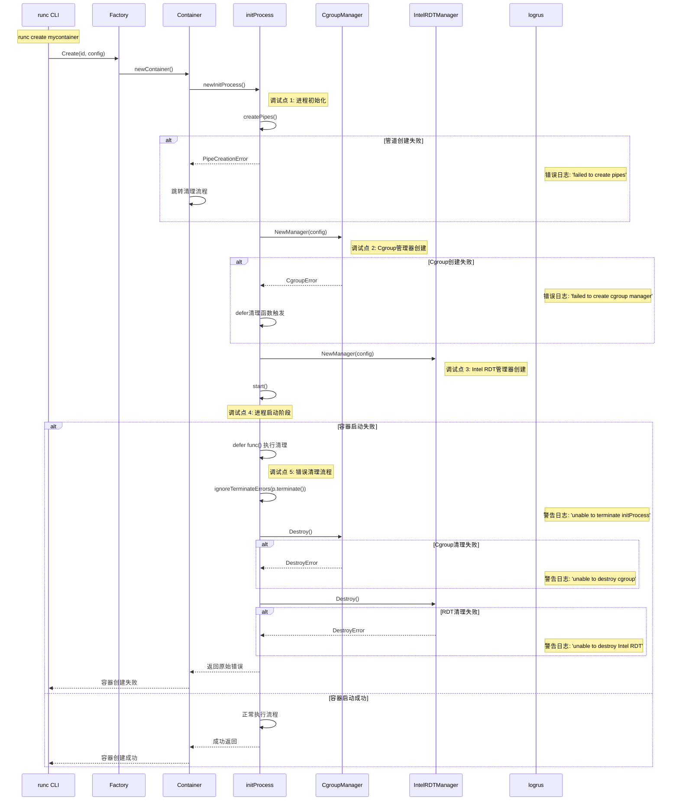
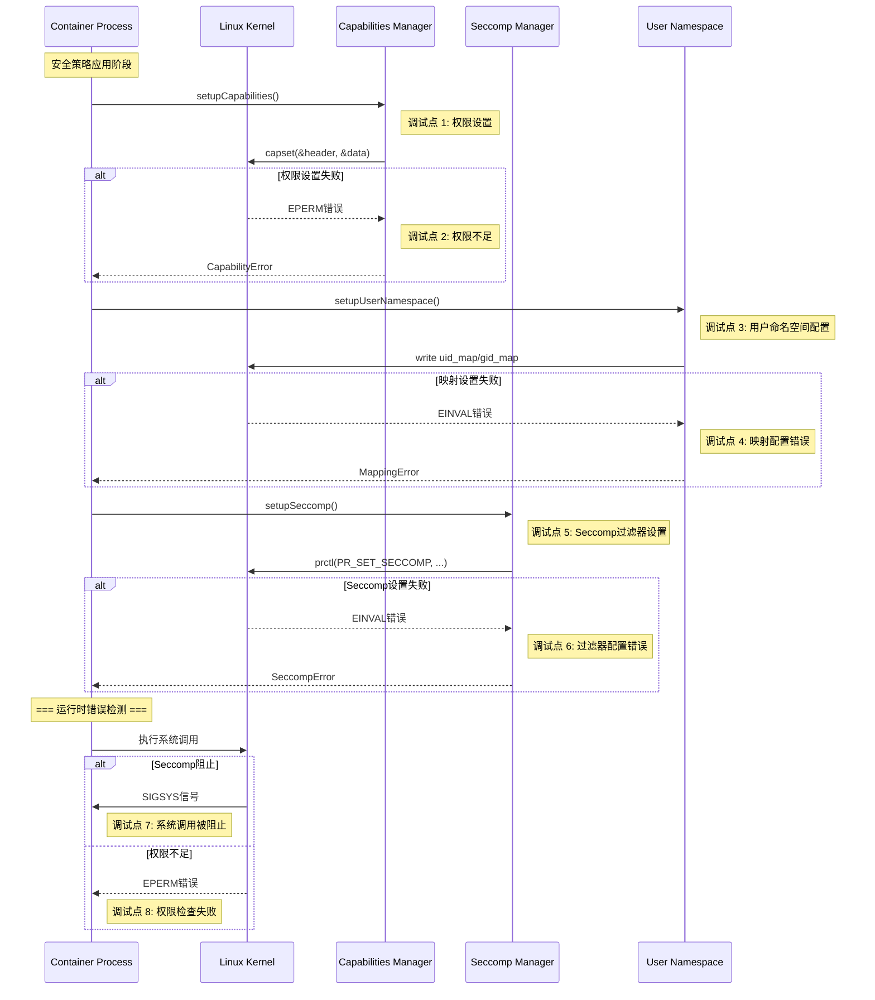

# runc 设计与实现完全指南

## 目录

1. [概述与架构](#1-概述与架构)
2. [容器创建流程深度解析](#2-容器创建流程深度解析)
3. [核心组件详细实现](#3-核心组件详细实现)
4. [Linux内核技术集成](#4-linux内核技术集成)
5. [安全机制与隔离策略](#5-安全机制与隔离策略)
6. [系统调用与底层实现](#6-系统调用与底层实现)
7. [资源管理与性能优化](#7-资源管理与性能优化)
8. [错误处理与调试技巧](#8-错误处理与调试技巧)
9. [最佳实践与扩展](#9-最佳实践与扩展)

---

## 1. 概述与架构

### 1.1 runc 简介

runc 是 Open Container Initiative (OCI) 运行时规范的参考实现，是一个轻量级的容器运行时工具。它专注于容器的底层执行，为更高级的容器编排工具（如 containerd、CRI-O）提供基础支持。

**核心特性：**
- 严格遵循 OCI 运行时规范
- 轻量级设计，专注于容器执行
- 深度集成 Linux 内核特性
- 强大的安全隔离机制
- 全面的资源管理能力

### 1.2 架构设计原则

```
设计原则（来自 PRINCIPLES.md）:
┌─────────────────────────────────────────────────────────────┐
│ 1. 简单性 (Simplicity)                                     │
│    '更少的代码更好' - 避免过度设计                          │
│                                                            │
│ 2. 可组合性 (Composability)                                │
│    '成为改进其他工具的组件' - 专注核心功能                  │
│                                                            │
│ 3. 可移植性 (Portability)                                  │
│    '容器必须能移植到尽可能多的机器' - 广泛兼容性            │
│                                                            │
│ 4. 文档化 (Documentation)                                  │
│    '不文档化就不合并' - 完善的文档                          │
│                                                            │
│ 5. 测试 (Testing)                                          │
│    '不测试就不合并' - 全面的测试覆盖                        │
└─────────────────────────────────────────────────────────────┘
```

### 1.3 核心目录结构

```
runc/
├── main.go                    # CLI 入口点
├── libcontainer/             # 核心容器库
│   ├── factory_linux.go      # 容器工厂
│   ├── container_linux.go    # 容器抽象
│   ├── process_linux.go      # 进程管理
│   ├── nsenter/             # 命名空间进入机制
│   │   └── nsexec.c         # C语言引导代码
│   ├── configs/             # 配置管理
│   ├── specconv/            # OCI规范转换
│   └── ...
├── create.go                 # create 命令实现
├── run.go                   # run 命令实现
├── start.go                 # start 命令实现
└── ...
```

---

## 2. 容器创建流程深度解析

### 2.1 命令执行路径

#### runc create 流程
```go
// create.go
Action: func(context *cli.Context) error {
    return startContainer(context, CT_ACT_CREATE, nil)
}
```

#### runc run 流程
```go
// run.go  
Action: func(context *cli.Context) error {
    return startContainer(context, CT_ACT_RUN, nil)
}
```

### 2.2 容器创建核心步骤



### 2.3 配置处理详细流程

#### OCI规范到libcontainer转换

**位置：** `libcontainer/specconv/spec_linux.go`

```go
func CreateLibcontainerConfig(opts *CreateOpts) (*configs.Config, error) {
    config := &configs.Config{
        Rootfs:      spec.Root.Path,
        Readonlyfs:  spec.Root.Readonly,
        Hostname:    spec.Hostname,
        Domainname:  spec.Domainname,
        // 处理进程配置
        // 处理挂载配置  
        // 处理安全配置
        // 处理资源配置
    }
    return config, nil
}
```

#### 关键转换逻辑

1. **命名空间映射**
```go
namespaceMapping = map[specs.LinuxNamespaceType]configs.NamespaceType{
    specs.PIDNamespace:     configs.NEWPID,
    specs.NetworkNamespace: configs.NEWNET,
    specs.MountNamespace:   configs.NEWNS,
    specs.UserNamespace:    configs.NEWUSER,
    // ...
}
```

2. **挂载配置处理**
```go
func setupUserNamespace(spec *specs.Spec, config *configs.Config) error {
    if len(spec.Linux.UIDMappings) == 0 {
        return nil
    }
    config.UidMappings = make([]configs.IDMap, len(spec.Linux.UIDMappings))
    // UID/GID映射处理
}
```

---

## 3. 核心组件详细实现

### 3.1 Factory 模式实现

**位置：** `libcontainer/factory_linux.go`

```go
type LinuxFactory struct {
    Root      string               // 容器状态根目录
    InitPath  string               // init 进程路径
    InitArgs  []string             // init 进程参数
    CriuPath  string               // CRIU 路径
    Validator validate.Validator    // 配置验证器
}

func (l *LinuxFactory) Create(id string, config *configs.Config) (Container, error) {
    // 1. 验证容器ID
    if l.Validator != nil {
        if err := l.Validator.Validate(config); err != nil {
            return nil, err
        }
    }
    
    // 2. 创建容器目录
    containerRoot := filepath.Join(l.Root, id)
    if _, err := os.Stat(containerRoot); err == nil {
        return nil, ErrExist
    }
    
    // 3. 创建容器实例
    c := &Container{
        id:     id,
        root:   containerRoot,
        config: config,
        // ...
    }
    
    return c, nil
}
```

### 3.2 Container 抽象层

**位置：** `libcontainer/container_linux.go`

```go
type Container struct {
    id                string
    root              string
    config            *configs.Config
    initPath          string
    initArgs          []string
    cgroupManager     cgroups.Manager
    intelRdtManager   intelrdt.Manager
    state             containerState
    created           time.Time
}

// 容器状态接口
type containerState interface {
    transition(s containerState) error
    destroy() error
    status() Status
}

// 状态实现
type stoppedState struct {
    c *Container
}

type runningState struct {
    c *Container
}
```

### 3.3 进程管理架构

**位置：** `libcontainer/process_linux.go`

```go
type parentProcess interface {
    pid() int
    start() error
    terminate() error
    wait() (*os.ProcessState, error)
    signal(os.Signal) error
    // ...
}

type initProcess struct {
    cmd             *exec.Cmd
    comm            *processComm
    manager         cgroups.Manager
    intelRdtManager intelrdt.Manager
    container       *Container
    fds             []string
    process         *Process
    bootstrapData   io.Reader
    // ...
}
```

---

## 4. Linux内核技术集成

### 4.1 命名空间管理

#### 命名空间类型与功能

| 命名空间 | 系统调用标志 | 隔离功能 | 特殊性 |
|----------|-------------|----------|--------|
| User | CLONE_NEWUSER | 用户/组ID | 必须最先创建 |
| PID | CLONE_NEWPID | 进程ID空间 | 需要fork生效 |
| Network | CLONE_NEWNET | 网络栈 | 复杂网络配置 |
| Mount | CLONE_NEWNS | 挂载点 | 文件系统隔离 |
| IPC | CLONE_NEWIPC | 进程通信 | 信号量、消息队列 |
| UTS | CLONE_NEWUTS | 主机名/域名 | 系统标识 |
| Cgroup | CLONE_NEWCGROUP | Cgroup视图 | 资源管理隔离 |
| Time | CLONE_NEWTIME | 系统时间 | 时钟虚拟化 |

#### nsexec.c 三阶段引导

**位置：** `libcontainer/nsenter/nsexec.c`

```c
// 阶段定义
enum {
    STAGE_PARENT = 0,     // 父进程
    STAGE_CHILD,          // 子进程（命名空间设置）  
    STAGE_INIT,           // 初始化进程
};

// 核心引导逻辑
static int child_func(void *arg) {
    struct nlconfig_t *config = (struct nlconfig_t *)arg;
    
    switch (config->cloneflags & STAGE_MASK) {
    case STAGE_CHILD:
        return stage_child(config);
    case STAGE_INIT:
        return stage_init(config);
    default:
        bail("invalid stage");
    }
}
```

### 4.2 Cgroups 集成策略

runc 通过 opencontainers/cgroups 库实现资源管理：

```go
// 自动检测 Cgroup 版本
func NewManager(config *configs.Cgroup) (cgroups.Manager, error) {
    if cgroups.IsCgroup2UnifiedMode() {
        return cgroupsv2.NewManager(config)
    }
    return cgroupsv1.NewManager(config)
}
```

#### 资源控制器映射

```go
type Resources struct {
    // CPU 资源
    CpuShares          *uint64  `json:"cpu_shares,omitempty"`
    CpuQuota           *int64   `json:"cpu_quota,omitempty"`
    CpuPeriod          *uint64  `json:"cpu_period,omitempty"`
    CpusetCpus         string   `json:"cpuset_cpus,omitempty"`
    
    // 内存资源
    Memory             *int64   `json:"memory,omitempty"`
    MemorySwap         *int64   `json:"memory_swap,omitempty"`
    MemorySwappiness   *uint64  `json:"memory_swappiness,omitempty"`
    
    // 块设备I/O
    BlkioWeight        *uint16  `json:"blkio_weight,omitempty"`
    BlkioThrottleReadBpsDevice  []ThrottleDevice `json:"blkio_throttle_read_bps_device,omitempty"`
    // ...
}
```

### 4.3 安全子系统集成

#### Capabilities 精细化权限控制

**位置：** `libcontainer/capabilities/capabilities.go`

```go
type Caps struct {
    pid  capability.Capabilities
    caps map[capability.CapType][]capability.Cap
}

func (c *Caps) ApplyCaps() error {
    for _, g := range []capability.CapType{
        capability.EFFECTIVE,
        capability.PERMITTED, 
        capability.INHERITABLE,
        capability.BOUNDING,
        capability.AMBIENT,
    } {
        if c.caps[g] != nil {
            c.pid.Set(g, c.caps[g]...)
        }
    }
    return c.pid.Apply(capability.CAPS | capability.BOUNDS)
}
```

#### Seccomp 系统调用过滤

**位置：** `libcontainer/seccomp/seccomp_linux.go`

```go
func InitSeccomp(config *configs.Seccomp) (int, error) {
    defaultAction, err := getAction(config.DefaultAction, config.DefaultErrnoRet)
    filter, err := libseccomp.NewFilter(defaultAction)
    
    // 添加架构支持
    for _, arch := range config.Architectures {
        scmpArch, err := libseccomp.GetArchFromString(arch)
        filter.AddArch(scmpArch)
    }
    
    // 添加系统调用规则
    for _, call := range config.Syscalls {
        action, err := getAction(call.Action, call.ErrnoRet)
        for _, name := range call.Names {
            syscallID, err := libseccomp.GetSyscallFromName(name)
            filter.AddRule(syscallID, action)
        }
    }
    
    return filter.Load()
}
```

---

## 5. 安全机制与隔离策略

### 5.1 多层安全架构

```
安全防护层次（从外到内）:
┌─────────────────────────────────────────────────────────┐
│ 1. 宿主机安全层                                          │
│    └── 内核安全模块、防火墙、审计                        │
│                                                        │
│ 2. 容器运行时安全层                                      │
│    └── runc 安全策略、权限控制                          │
│                                                        │
│ 3. 命名空间隔离层                                        │
│    └── PID、NET、MNT、USER等命名空间                     │
│                                                        │
│ 4. 权限控制层                                           │
│    └── Capabilities、NoNewPrivileges                   │
│                                                        │
│ 5. 系统调用过滤层                                        │
│    └── Seccomp BPF过滤器                               │
│                                                        │
│ 6. 强制访问控制层                                        │
│    └── AppArmor、SELinux策略                           │
│                                                        │
│ 7. 资源限制层                                           │
│    └── Cgroups资源限制                                 │
│                                                        │
│ 8. 文件系统安全层                                        │
│    └── 只读挂载、路径屏蔽                               │
└─────────────────────────────────────────────────────────┘
```

### 5.2 权限最小化实现

#### NoNewPrivileges 机制

```go
// standard_init_linux.go
if l.config.NoNewPrivileges {
    if err := unix.Prctl(unix.PR_SET_NO_NEW_PRIVS, 1, 0, 0, 0); err != nil {
        return &os.SyscallError{Syscall: "prctl(SET_NO_NEW_PRIVS)", Err: err}
    }
}
```

#### 默认安全配置

```go
const defaultMountFlags = unix.MS_NOEXEC | unix.MS_NOSUID | unix.MS_NODEV

var defaultMaskedPaths = []string{
    "/proc/acpi",
    "/proc/kcore", 
    "/proc/keys",
    "/proc/latency_stats",
    "/proc/timer_list",
    "/proc/timer_stats",
    "/proc/sched_debug",
    "/proc/scsi",
    "/sys/firmware",
}

var defaultReadonlyPaths = []string{
    "/proc/asound",
    "/proc/bus",
    "/proc/fs", 
    "/proc/irq",
    "/proc/sys",
    "/proc/sysrq-trigger",
}
```

### 5.3 安全漏洞防护

#### CVE-2024-21626 文件描述符泄漏防护

```go
// 在执行前关闭所有非标准文件描述符
if err := utils.UnsafeCloseFrom(l.config.PassedFilesCount + 3); err != nil {
    return fmt.Errorf("unable to close fds: %w", err)
}
```

#### 工作目录验证

```go
func verifyCwd() error {
    if wd, err := linux.Getwd(); errors.Is(err, unix.ENOENT) {
        return errors.New("current working directory is outside of container mount namespace root")
    }
    return nil
}
```

---

## 6. 系统调用与底层实现

### 6.1 关键系统调用分析

#### 进程创建与命名空间

```c
// nsexec.c 中的核心系统调用
clone_flags = CLONE_PARENT | SIGCHLD;
if (config->namespaces & CLONE_NEWUSER)
    clone_flags |= CLONE_NEWUSER;
if (config->namespaces & CLONE_NEWPID)
    clone_flags |= CLONE_NEWPID;
// ... 其他命名空间标志

child_pid = clone(child_func, child_stack, clone_flags, config);
```

#### 挂载操作系统调用

```go
// mount_linux.go
func mount(source, target, fstype string, flags uintptr, data string) error {
    return unix.Mount(source, target, fstype, flags, data)
}

func pivotRoot(newroot, oldroot string) error {
    return unix.PivotRoot(newroot, oldroot)
}
```

#### 安全相关系统调用

```go
// 设置进程能力
func setCapabilities(caps *configs.Capabilities) error {
    return capability.NewPid(0).Set(caps)
}

// 应用seccomp过滤器  
func applySeccomp(config *configs.Seccomp) error {
    fd, err := InitSeccomp(config)
    return unix.Prctl(unix.PR_SET_SECCOMP, unix.SECCOMP_MODE_FILTER, uintptr(fd), 0, 0)
}
```

### 6.2 进程间通信机制

#### 通信通道设计

```go
type processComm struct {
    // 初始化配置传输通道
    initSockParent *os.File
    initSockChild  *os.File
    
    // 同步控制通道
    syncSockParent *syncSocket  
    syncSockChild  *syncSocket
    
    // 日志转发通道
    logPipeParent *os.File
    logPipeChild  *os.File
}
```

#### 同步协议实现

```go
const (
    procReady      syncType = iota // 进程就绪
    procError                      // 进程错误  
    procSeccomp                    // Seccomp设置
    procMountPlease                // 挂载请求
    procMountFd                    // 挂载文件描述符
)

func (s *syncSocket) SendSync(sync syncType) error {
    return writeSync(s.parent, sync)
}

func (s *syncSocket) ReadSync() (syncType, error) {
    return readSync(s.child)
}
```

---

## 7. 资源管理与性能优化

### 7.1 Cgroups 资源控制

#### 内存管理策略

```go
type LinuxMemory struct {
    Limit            *int64  `json:"limit,omitempty"`           // 硬限制
    Reservation      *int64  `json:"reservation,omitempty"`     // 软限制
    Swap             *int64  `json:"swap,omitempty"`            // Swap限制
    KernelMemoryTCP  *int64  `json:"kernelTCP,omitempty"`       // TCP缓冲区限制
    Swappiness       *uint64 `json:"swappiness,omitempty"`      // 交换倾向
    DisableOOMKiller *bool   `json:"disableOOMKiller,omitempty"` // 禁用OOM Killer
}
```

#### CPU调度优化

```go
type LinuxCPU struct {
    Shares          *uint64 `json:"shares,omitempty"`          // CPU权重
    Quota           *int64  `json:"quota,omitempty"`           // CPU配额(微秒)
    Burst           *uint64 `json:"burst,omitempty"`           // CPU突发
    Period          *uint64 `json:"period,omitempty"`          // 调度周期
    RealtimeRuntime *int64  `json:"realtimeRuntime,omitempty"` // 实时运行时间
    RealtimePeriod  *uint64 `json:"realtimePeriod,omitempty"`  // 实时周期
    Cpus            string  `json:"cpus,omitempty"`            // CPU集合
    Mems            string  `json:"mems,omitempty"`            // 内存节点
}
```

### 7.2 高级资源管理

#### Intel RDT 集成

**位置：** `libcontainer/intelrdt/intelrdt.go`

```go
type Manager interface {
    Apply(pid int) error
    GetStats() (*Stats, error)  
    Destroy() error
    Set(container *configs.Config) error
}

// L3缓存分配
func (m *intelRdtManager) setL3CacheSchema() error {
    return writeIntelRdtFile(m.path, "schemata", m.config.L3CacheSchema)
}

// 内存带宽分配
func (m *intelRdtManager) setMemBwSchema() error {
    return writeIntelRdtFile(m.path, "schemata", m.config.MemBwSchema)
}
```

### 7.3 性能监控与调优

#### 资源使用统计

```go
func (m *Manager) GetStats() (*cgroups.Stats, error) {
    stats := &cgroups.Stats{}
    
    // 内存统计
    memoryStats, err := getMemoryStats(m.path)
    stats.MemoryStats = memoryStats
    
    // CPU统计
    cpuStats, err := getCpuStats(m.path)
    stats.CpuStats = cpuStats
    
    // I/O统计
    blkioStats, err := getBlkioStats(m.path)
    stats.BlkioStats = blkioStats
    
    return stats, nil
}
```

---

## 8. 错误处理与调试技巧

### 8.1 错误处理架构

#### 分层错误处理

```go
// 容器创建失败时的清理机制
defer func() {
    if retErr != nil {
        // 终止进程
        if err := ignoreTerminateErrors(p.terminate()); err != nil {
            logrus.WithError(err).Warn("unable to terminate initProcess")
        }
        
        // 清理Cgroup
        if err := p.manager.Destroy(); err != nil {
            logrus.WithError(err).Warn("unable to destroy cgroup")
        }
        
        // 清理Intel RDT
        if p.intelRdtManager != nil {
            if err := p.intelRdtManager.Destroy(); err != nil {
                logrus.WithError(err).Warn("unable to destroy Intel RDT")
            }
        }
    }
}()
```

#### OOM检测与处理

```go
func (p *initProcess) wait() (*os.ProcessState, error) {
    err := p.cmd.Wait()
    
    // 检查OOM Kill
    if p.manager != nil {
        if oom, err2 := p.manager.OOMKillCount(); err2 == nil && oom > 0 {
            return nil, &exec.ExitError{
                ProcessState: p.cmd.ProcessState,
                Stderr:       []byte("container init was OOM-killed (memory limit too low?)"),
            }
        }
    }
    
    return p.cmd.ProcessState, err
}
```

### 8.2 调试工具与技巧

#### 状态检查命令

```bash
# 查看容器状态
runc state <container-id>

# 查看容器进程
runc ps <container-id>

# 查看容器事件
runc events <container-id>

# 检查cgroup状态
cat /sys/fs/cgroup/memory/docker/<container-id>/memory.usage_in_bytes
cat /sys/fs/cgroup/cpu/docker/<container-id>/cpu.stat
```

#### 日志分析

```go
// 启用调试日志
logrus.SetLevel(logrus.DebugLevel)

// 关键调试信息
logrus.WithFields(logrus.Fields{
    "container": container.ID(),
    "pid":       process.Pid(),
    "namespaces": container.Config().Namespaces,
}).Debug("container process started")
```

### 8.3 常见问题诊断

#### 权限问题

```bash
# 检查用户命名空间映射
cat /proc/<pid>/uid_map
cat /proc/<pid>/gid_map

# 检查进程权限
grep Cap /proc/<pid>/status
```

#### 挂载问题

```bash
# 检查挂载点
cat /proc/<pid>/mounts

# 检查挂载传播
findmnt -D
```

### 8.4 错误处理调试追踪流程图



### 8.5 OOM检测和处理调试流程图

```mermaid
graph TD
    A[容器运行中] --> B[内存使用增长]
    B --> C{达到内存限制}
    
    C -->|否| B
    C -->|是| D[内核OOM Killer激活]
    
    D --> E[选择牺牲进程]
    E --> F[发送SIGKILL]
    F --> G[进程被终止]
    
    G --> H[runc检测进程状态]
    H --> I[调用wait()方法]
    I --> J[检查OOMKillCount]
    
    J --> K{OOM计数 > 0}
    K -->|是| L[构造OOM错误信息]
    K -->|否| M[返回正常退出状态]
    
    L --> N[返回OOM ExitError]
    
    subgraph DEBUG["调试追踪点"]
        T1[监控memory.usage_in_bytes]
        T2[检查memory.oom_control]
        T3[dmesg OOM killer日志]
        T4[检查进程退出状态]
    end
    
    subgraph COMMANDS["调试命令"]
        CMD1[watch cat /sys/fs/cgroup/memory/.../memory.usage_in_bytes]
        CMD2[cat /sys/fs/cgroup/memory/.../memory.oom_control]
        CMD3[dmesg | grep -i 'killed process']
        CMD4[runc events container-id]
    end
    
    style A fill:#f9f,stroke:#333,stroke-width:2px
    style T1 fill:#ff9,stroke:#333,stroke-width:1px
    style T2 fill:#ff9,stroke:#333,stroke-width:1px
    style T3 fill:#ff9,stroke:#333,stroke-width:1px
    style T4 fill:#ff9,stroke:#333,stroke-width:1px
```

### 8.6 权限和安全错误调试流程图



### 8.7 综合错误诊断调试脚本

```bash
#!/bin/bash
# runc 错误诊断综合调试脚本

CONTAINER_ID=${1:-"debug-container"}
DEBUG_LOG="/tmp/runc-debug-${CONTAINER_ID}.log"

echo "=== runc 错误诊断调试工具 ===" | tee $DEBUG_LOG
echo "容器ID: $CONTAINER_ID" | tee -a $DEBUG_LOG
echo "时间: $(date)" | tee -a $DEBUG_LOG
echo "" | tee -a $DEBUG_LOG

# 1. 检查容器状态
echo "1. 容器状态检查:" | tee -a $DEBUG_LOG
runc state $CONTAINER_ID 2>&1 | tee -a $DEBUG_LOG || echo "容器状态获取失败" | tee -a $DEBUG_LOG
echo "" | tee -a $DEBUG_LOG

# 2. 获取容器PID
CONTAINER_PID=$(runc state $CONTAINER_ID 2>/dev/null | jq -r '.pid // empty')
if [[ -n "$CONTAINER_PID" && "$CONTAINER_PID" != "null" ]]; then
    echo "容器主进程PID: $CONTAINER_PID" | tee -a $DEBUG_LOG
    
    # 3. 检查进程状态
    echo "2. 进程状态检查:" | tee -a $DEBUG_LOG
    ps -f -p $CONTAINER_PID 2>&1 | tee -a $DEBUG_LOG || echo "进程不存在" | tee -a $DEBUG_LOG
    echo "" | tee -a $DEBUG_LOG
    
    # 4. 检查命名空间
    echo "3. 命名空间检查:" | tee -a $DEBUG_LOG
    ls -la /proc/$CONTAINER_PID/ns/ 2>&1 | tee -a $DEBUG_LOG || echo "命名空间信息获取失败" | tee -a $DEBUG_LOG
    echo "" | tee -a $DEBUG_LOG
    
    # 5. 检查权限和能力
    echo "4. 权限能力检查:" | tee -a $DEBUG_LOG
    echo "用户映射:" | tee -a $DEBUG_LOG
    cat /proc/$CONTAINER_PID/uid_map 2>&1 | tee -a $DEBUG_LOG || echo "UID映射获取失败" | tee -a $DEBUG_LOG
    cat /proc/$CONTAINER_PID/gid_map 2>&1 | tee -a $DEBUG_LOG || echo "GID映射获取失败" | tee -a $DEBUG_LOG
    echo "进程能力:" | tee -a $DEBUG_LOG
    grep Cap /proc/$CONTAINER_PID/status 2>&1 | tee -a $DEBUG_LOG || echo "能力信息获取失败" | tee -a $DEBUG_LOG
    echo "" | tee -a $DEBUG_LOG
    
    # 6. 检查Seccomp状态
    echo "5. Seccomp状态检查:" | tee -a $DEBUG_LOG
    grep Seccomp /proc/$CONTAINER_PID/status 2>&1 | tee -a $DEBUG_LOG || echo "Seccomp状态获取失败" | tee -a $DEBUG_LOG
    echo "" | tee -a $DEBUG_LOG
else
    echo "无法获取容器PID，跳过进程相关检查" | tee -a $DEBUG_LOG
fi

# 7. 检查Cgroup状态
echo "6. Cgroup状态检查:" | tee -a $DEBUG_LOG
CGROUP_PATHS=(
    "/sys/fs/cgroup/memory/docker/$CONTAINER_ID"
    "/sys/fs/cgroup/cpu/docker/$CONTAINER_ID"
    "/sys/fs/cgroup/freezer/docker/$CONTAINER_ID"
    "/sys/fs/cgroup/docker/$CONTAINER_ID"  # cgroup v2
)

for path in "${CGROUP_PATHS[@]}"; do
    if [[ -d "$path" ]]; then
        echo "Cgroup路径: $path" | tee -a $DEBUG_LOG
        echo "内存使用:" | tee -a $DEBUG_LOG
        cat $path/memory.usage_in_bytes 2>/dev/null | tee -a $DEBUG_LOG || \
        cat $path/memory.current 2>/dev/null | tee -a $DEBUG_LOG || \
        echo "内存信息获取失败" | tee -a $DEBUG_LOG
        
        echo "CPU统计:" | tee -a $DEBUG_LOG
        cat $path/cpu.stat 2>/dev/null | head -5 | tee -a $DEBUG_LOG || \
        cat $path/cpuacct.usage 2>/dev/null | tee -a $DEBUG_LOG || \
        echo "CPU信息获取失败" | tee -a $DEBUG_LOG
        break
    fi
done
echo "" | tee -a $DEBUG_LOG

# 8. 检查最近的dmesg错误
echo "7. 系统日志检查 (最近5分钟):" | tee -a $DEBUG_LOG
dmesg -T | awk -v container="$CONTAINER_ID" -v since="$(date -d '5 minutes ago' '+%Y-%m-%d %H:%M')" \
    '$0 >= since && ($0 ~ /oom-killer/ || $0 ~ /segfault/ || $0 ~ /killed process/ || $0 ~ container)' \
    2>&1 | tee -a $DEBUG_LOG || echo "dmesg信息获取失败" | tee -a $DEBUG_LOG
echo "" | tee -a $DEBUG_LOG

# 9. 检查runc日志
echo "8. runc 详细日志:" | tee -a $DEBUG_LOG
echo "执行以下命令获取详细调试信息:" | tee -a $DEBUG_LOG
echo "runc --debug state $CONTAINER_ID" | tee -a $DEBUG_LOG
echo "runc --debug events $CONTAINER_ID" | tee -a $DEBUG_LOG
echo "" | tee -a $DEBUG_LOG

echo "=== 调试报告完成 ===" | tee -a $DEBUG_LOG
echo "详细日志保存在: $DEBUG_LOG" | tee -a $DEBUG_LOG
```
```

#### 网络问题

```bash  
# 检查网络命名空间
ip netns list

# 在容器网络命名空间中执行命令
nsenter -t <pid> -n ip addr show
```

---

## 9. 最佳实践与扩展

### 9.1 安全配置最佳实践

#### 高安全性容器配置

```json
{
    "ociVersion": "1.0.0",
    "process": {
        "user": {
            "uid": 1000,
            "gid": 1000
        },
        "capabilities": {
            "effective": [],
            "bounding": [],
            "inheritable": [],
            "permitted": [],
            "ambient": []
        },
        "noNewPrivileges": true,
        "oomScoreAdj": 100
    },
    "root": {
        "path": "rootfs",
        "readonly": true
    },
    "linux": {
        "namespaces": [
            {"type": "pid"},
            {"type": "network"},
            {"type": "ipc"},
            {"type": "uts"},
            {"type": "mount"},
            {"type": "user"}
        ],
        "resources": {
            "memory": {
                "limit": 134217728,
                "swappiness": 0
            },
            "cpu": {
                "shares": 512,
                "quota": 50000,
                "period": 100000
            }
        },
        "seccomp": {
            "defaultAction": "SCMP_ACT_ERRNO",
            "syscalls": [
                {
                    "names": ["read", "write", "exit", "exit_group"],
                    "action": "SCMP_ACT_ALLOW"
                }
            ]
        }
    }
}
```

### 9.2 性能优化策略

#### 容器启动优化

1. **镜像层优化**
   - 合并层以减少I/O操作
   - 使用多阶段构建
   - 选择合适的基础镜像

2. **资源预分配**
   - 设置合理的内存限制
   - 配置CPU亲和性
   - 预分配磁盘空间

3. **网络优化**
   - 使用高性能网络插件
   - 配置网络缓冲区大小
   - 启用网络负载均衡

#### 内存管理优化

```json
{
    "memory": {
        "limit": 1073741824,          // 1GB硬限制
        "reservation": 536870912,     // 512MB软限制
        "swappiness": 1,              // 最小化swap使用
        "kernel": 134217728,          // 128MB内核内存限制
        "disableOOMKiller": false     // 启用OOM保护
    }
}
```

### 9.3 扩展开发指南

#### 自定义Hook开发

```go
type Hook struct {
    Path    string   `json:"path"`
    Args    []string `json:"args,omitempty"`
    Env     []string `json:"env,omitempty"`
    Timeout *int     `json:"timeout,omitempty"`
}

// Hook执行时机
const (
    CreateRuntime    = "createRuntime"    // 运行时创建后
    CreateContainer  = "createContainer"  // 容器创建后
    StartContainer   = "startContainer"   // 容器启动前
    Poststart        = "poststart"        // 容器启动后
    Poststop         = "poststop"         // 容器停止后
)
```

#### 自定义网络插件

```go
type NetworkStrategy interface {
    Create(*network, int) error
    Initialize(*network) error
    Detach(*configs.Network) error
    Attach(*configs.Network) error
}

// 注册自定义网络策略
strategies["custom"] = &customNetworkStrategy{}
```

### 9.4 监控与可观测性

#### 指标收集

```go
// 容器运行时指标
type ContainerMetrics struct {
    CPUUsage     float64 `json:"cpu_usage"`
    MemoryUsage  int64   `json:"memory_usage"`
    NetworkRx    int64   `json:"network_rx"`
    NetworkTx    int64   `json:"network_tx"`
    DiskRead     int64   `json:"disk_read"`
    DiskWrite    int64   `json:"disk_write"`
}
```

#### 事件监控

```bash
# 实时监控容器事件
runc events --stats <container-id> | jq '.'

# 自定义事件处理
runc events <container-id> | while read event; do
    echo "Container event: $event"
    # 处理事件逻辑
done
```

---

## 总结

runc 作为 OCI 运行时规范的参考实现，展现了现代容器技术的精髓。它通过精密的架构设计和深度的 Linux 内核集成，提供了：

1. **完整的隔离机制** - 通过命名空间、Cgroups、安全模块实现多层隔离
2. **灵活的资源管理** - 精确的资源控制和性能优化
3. **强大的安全保障** - 多层防护和漏洞缓解机制
4. **优秀的可扩展性** - 模块化设计支持自定义扩展

理解 runc 的设计和实现，不仅有助于深入掌握容器技术，更为开发高性能、高安全性的容器应用奠定了坚实基础。随着容器技术的不断发展，runc 的架构思想和实现细节将继续为容器生态提供重要参考。

**参考资源：**
- [OCI Runtime Specification](https://github.com/opencontainers/runtime-spec)
- [runc GitHub Repository](https://github.com/opencontainers/runc)
- [Linux Manual Pages](https://man7.org/linux/man-pages/)
- [Cgroups Documentation](https://www.kernel.org/doc/Documentation/cgroup-v2.txt)