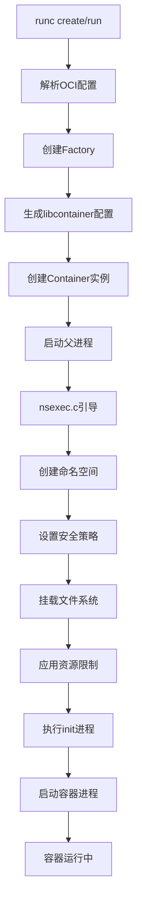
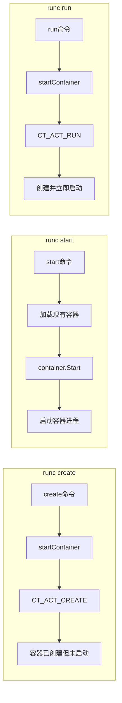
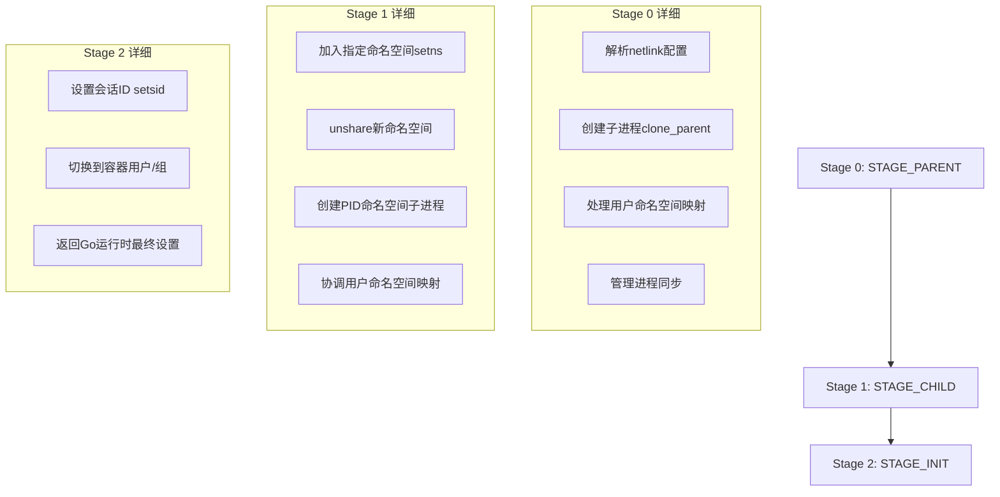
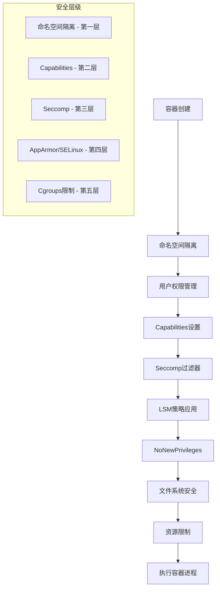
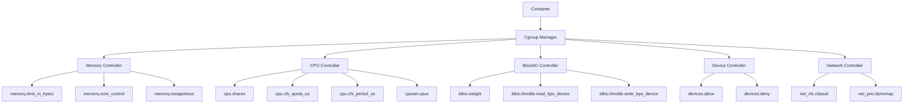
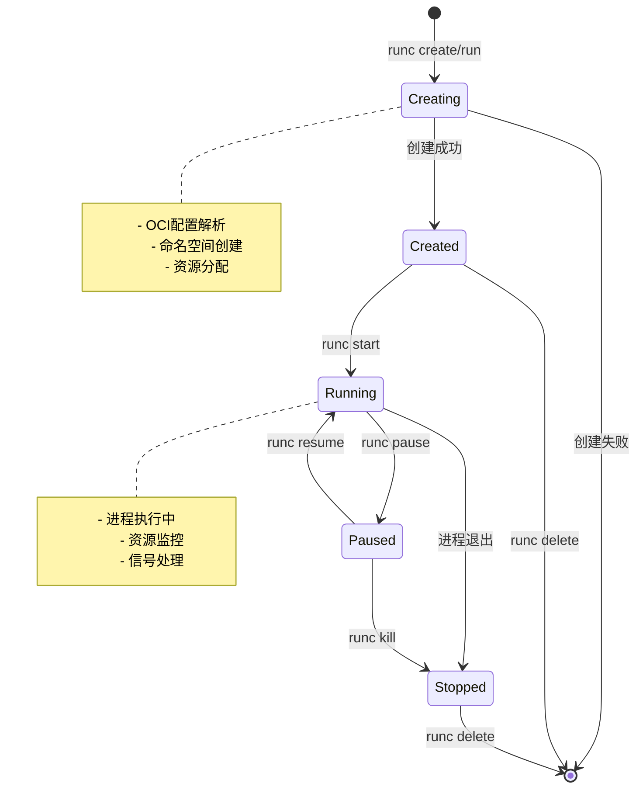
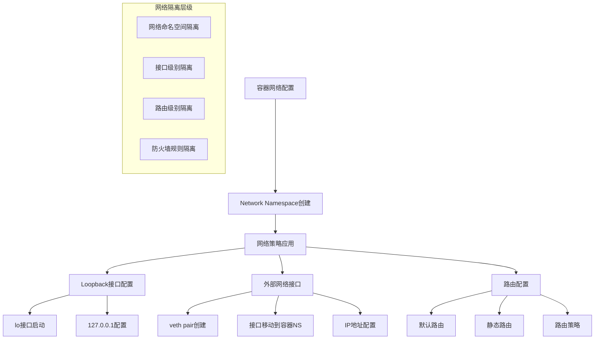

# runc 容器生命周期流程图

## 1. runc 容器创建总体流程



## 2. runc 命令流程对比



## 3. nsexec.c 三阶段引导过程



## 4. 命名空间创建顺序和依赖关系

```
命名空间创建顺序（关键在于User NS必须最先创建）:

┌─────────────┐    ┌─────────────┐    ┌─────────────┐
│ User NS     │───▶│ IPC NS      │───▶│ UTS NS      │
│ (NEWUSER)   │    │ (NEWIPC)    │    │ (NEWUTS)    │
│ 用户隔离    │    │ IPC隔离     │    │ 主机名隔离  │
└─────────────┘    └─────────────┘    └─────────────┘
       │                   │                   │
       ▼                   ▼                   ▼
┌─────────────┐    ┌─────────────┐    ┌─────────────┐
│ Network NS  │    │ PID NS      │    │ Mount NS    │
│ (NEWNET)    │    │ (NEWPID)    │    │ (NEWNS)     │
│ 网络隔离    │    │ 进程隔离    │    │ 文件系统隔离│
└─────────────┘    └─────────────┘    └─────────────┘
       │                   │                   │
       ▼                   ▼                   ▼
┌─────────────┐    ┌─────────────┐
│ Cgroup NS   │    │ Time NS     │
│ (NEWCGROUP) │    │ (NEWTIME)   │
│ Cgroup隔离  │    │ 时间隔离    │
└─────────────┘    └─────────────┘
```

## 5. 进程通信和同步机制

```
父进程 (runc)          子进程 (init)         容器进程
      │                     │                    │
      │  initSockParent ◄──►│ initSockChild      │
      │  ─────────────────── │                   │
      │                     │                   │
      │  syncSockParent ◄──►│ syncSockChild      │
      │  ─────────────────── │                   │
      │                     │                   │
      │  logPipeParent  ◄───│ logPipeChild       │
      │  ─────────────────── │                   │
      │                     │                   │
      │     FIFO通道     ◄──│────────────────────│
      │  ─────────────────── │                   │
      
同步消息类型:
- SYNC_USERMAP_PLS/ACK  (用户映射请求/确认)
- SYNC_RECVPID_PLS/ACK  (PID发送请求/确认)
- SYNC_GRANDCHILD       (孙进程就绪)
- SYNC_CHILD_FINISH     (子进程完成)
- SYNC_TIMEOFFSETS_*    (时间偏移设置)
```

## 6. 安全策略应用流程



## 7. 文件系统挂载和隔离流程

```
┌────────────────────────────────────────────────────────────┐
│                      Rootfs 准备流程                       │
├────────────────────────────────────────────────────────────┤
│                                                           │
│  1. Mount Namespace 创建                                  │
│     └── unshare(CLONE_NEWNS)                             │
│                                                           │
│  2. 基础挂载点准备                                        │
│     ├── /proc (proc文件系统)                             │
│     ├── /sys (sysfs文件系统)                             │
│     ├── /dev (devtmpfs或bind挂载)                        │
│     └── /dev/pts (devpts伪终端)                          │
│                                                           │
│  3. 用户挂载点处理                                        │
│     ├── bind挂载 (源目录绑定)                            │
│     ├── tmpfs挂载 (内存文件系统)                         │
│     └── 特殊文件系统                                      │
│                                                           │
│  4. 安全挂载选项                                          │
│     ├── MS_NOEXEC (禁止执行)                             │
│     ├── MS_NOSUID (禁止setuid)                           │
│     ├── MS_NODEV (禁止设备文件)                          │
│     └── 挂载传播控制                                      │
│                                                           │
│  5. pivot_root或chroot                                   │
│     └── 切换根文件系统                                    │
│                                                           │
│  6. 路径安全处理                                          │
│     ├── MaskedPaths (隐藏路径)                           │
│     └── ReadonlyPaths (只读路径)                         │
│                                                           │
└────────────────────────────────────────────────────────────┘
```

## 8. Cgroups 资源管理架构



## 9. 容器状态转换图



## 10. runc 错误处理和清理流程

```
┌─────────────────────────────────────────────────────────────┐
│                    错误处理和清理机制                        │
├─────────────────────────────────────────────────────────────┤
│                                                            │
│  创建阶段错误处理:                                          │
│  ┌──────────────────────────────────────────────────────┐   │
│  │  defer func() {                                     │   │
│  │      if retErr != nil {                             │   │
│  │          _ = p.terminate()        // 终止进程       │   │
│  │          _ = p.manager.Destroy()  // 清理cgroup     │   │
│  │          _ = p.intelRdtManager.Destroy() // 清理RDT │   │
│  │      }                                              │   │
│  │  }()                                                │   │
│  └──────────────────────────────────────────────────────┘   │
│                                                            │
│  运行时错误检测:                                            │
│  ┌──────────────────────────────────────────────────────┐   │
│  │  - OOM检测和处理                                     │   │
│  │  - 进程退出状态监控                                  │   │
│  │  - 信号传播和处理                                    │   │
│  │  - 僵尸进程清理                                      │   │
│  │  - 文件描述符泄漏防护                                │   │
│  └──────────────────────────────────────────────────────┘   │
│                                                            │
│  清理顺序:                                                 │
│  1. 发送SIGKILL信号                                        │
│  2. 等待进程终止                                           │
│  3. 清理cgroup资源                                         │
│  4. 清理Intel RDT资源                                      │
│  5. 清理挂载点                                             │
│  6. 清理状态文件                                           │
│  7. 关闭通信通道                                           │
│                                                            │
└─────────────────────────────────────────────────────────────┘
```

## 11. 网络配置和管理流程



## 12. 系统调用使用时序图


这些图表详细展示了runc容器运行时的各个关键流程，从高层架构到具体实现细节，帮助理解runc是如何协调Linux内核的各种特性来实现安全、隔离的容器环境。